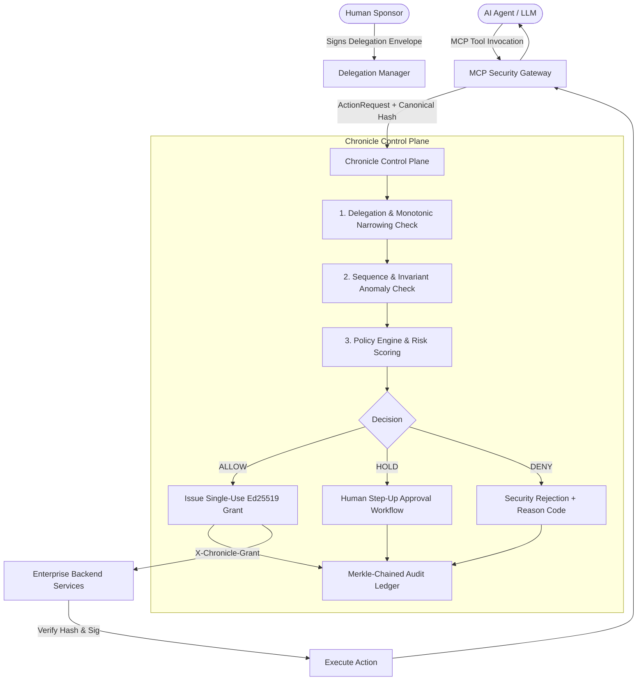

# Chronicle: Autonomous Action Control Plane (AACT) for AI Agents

[](https://nodejs.org)
[](https://www.typescriptlang.org/)
[](#)
[](#)

> **Chronicle** is an enterprise-grade Autonomous Action Control Plane (AACT) designed specifically for AI Agents executing real-world tool operations across payment gateways, CRM databases, cloud infrastructure, and enterprise communications.

---

## 1. Problem Statement: The AI Agent Authorization Deficit

Modern Large Language Models (LLMs) and autonomous agents (via protocols like **Model Context Protocol (MCP)** or custom tool executors) present fundamentally new security vulnerabilities that traditional RBAC/ABAC cannot address:

1. **TOCTOU (Time-of-Check to Time-of-Use) Parameter Tampering**: Agents can ask permission for a harmless operation (e.g. $50 refund) and subsequently invoke the tool with adversarial parameters (e.g. $50,000).
2. **Adversarial Sequences & Multi-Step Exfiltration**: Individual tool calls appear benign in isolation (e.g. reading customer PII, then sending an outbound email), but in sequence form high-severity data exfiltration.
3. **Privilege Creep via Sub-Delegation**: Autonomous agents sub-delegating tasks can accidentally or maliciously grant downstream agents broader authority than they possess.
4. **Repudiation & Lack of Non-Repudiable Cryptographic Ledgering**: Traditional loggers can be altered, truncated, or forged.
5. **Smurfing & Structuring**: An agent restricted to $1,000 per transaction can bypass limits by executing 10 transactions of $950.

---

## 2. Chronicle Architecture & Pillars

Chronicle enforces **Zero-Trust Autonomous Action Control** through six core pillars:



### Core Pillars

1. **Mathematical Monotonic Privilege Narrowing**:
   - Sub-delegation constraints can only shrink: $\text{Tools}_{\text{child}} \subseteq \text{Tools}_{\text{parent}}$, $\text{Limit}_{\text{child}} \le \text{Limit}_{\text{parent}}$, $\text{Expiry}_{\text{child}} \le \text{Expiry}_{\text{parent}}$.
   - Every delegation is tied to a verified Human Sponsor and cryptographically signed with Ed25519.

2. **Canonical Parameter Hash Binding (Anti-TOCTOU)**:
   - Uses recursive key-sorted canonical JSON stringification and SHA-256 parameter hashing.
   - Downstream enterprise tools verify that `grant.parametersHash === sha256(canonical(actualPayload))` before executing.

3. **Stateful Sequence & Behavioral Invariant Monitoring**:
   - Tracks action history across sessions and tasks.
   - Detects forbidden sequences (e.g. `[read_customer_pii -> send_external_email]`).
   - Enforces mandatory prerequisites (e.g. `verify_identity` before `send_wire_transfer`).
   - Defeats smurfing/structuring via rolling-window cumulative counters.

4. **Tamper-Evident Merkle-Chained Audit Ledger**:
   - Every evaluated action generates an `AuthorizationReceipt` with `previousReceiptHash`, `receiptHash`, and an Ed25519 signature from the Control Plane.
   - Cryptographic chain integrity audits can be run in real-time.

5. **Real-Time Blast Radius Analyzer**:
   - Computes reachable tools, accessible resource sensitivities, maximum financial exposure, and privilege escalation vectors for any agent.

6. **Instant Emergency Kill Switch & Agent Quarantine**:
   - Master lockdown toggle or per-agent quarantine severs tool access in $< 0.1\text{ms}$.

---

## 3. Monorepo Structure

```text
CHRONICLE/
├── packages/
│   ├── core-types/            # Canonical domain types, enums, receipts, graphs
│   ├── crypto-primitives/     # Ed25519, canonical JSON, SHA-256 parameter hashing
│   ├── delegation-manager/    # Monotonic privilege narrowing & chain verifier
│   ├── sequence-detector/     # Sequence anomaly detection, cumulative limits
│   ├── policy-engine/         # Dynamic risk engine, step-up HOLD, simulation
│   ├── audit-ledger/          # Merkle-chained tamper-evident receipt ledger
│   └── blast-radius/          # Blast radius, reachability, escalation analysis
├── apps/
│   ├── control-plane/         # AACT HTTP API Server + Glassmorphic Dashboard
│   ├── mcp-gateway/           # Model Context Protocol security proxy
│   └── mock-enterprise-tools/ # Realistic payment, CRM, cloud, comms services
├── tests/
│   ├── run_tests.ts           # 15 Core integration & unit test suites
│   └── attack-scenarios/      # 7 Adversarial attack simulations
└── benchmarks/
    └── benchmark.ts           # Latency & throughput benchmark suite
```

---

## 4. Adversarial Attack Scenarios Neutralized

Chronicle includes an automated adversarial attack suite (`npm run test:attacks`) verifying defense against 7 real-world attack vectors:

| Attack Vector | Attacker Objective | Chronicle Defense Mechanism | Status |
|---|---|---|:---:|
| **1. TOCTOU Parameter Tampering** | Asks for $50 refund, tampers payload to $50,000 | Canonical SHA-256 Hash Binding on Ed25519 Grant | **NEUTRALIZED** |
| **2. Expired Grant Replay** | Replays captured authorization grant after expiry | Ephemeral 60s Grant TTL Clock-Skew Check | **NEUTRALIZED** |
| **3. Prompt Injection & Intent Drift** | Injects prompt into Support agent to dispatch $10,000 wire | Task Intent Scope & Tool Whitelist Gating | **NEUTRALIZED** |
| **4. Forbidden Sequence Exfiltration** | Reads confidential PII then emails external recipient | Stateful Action Sequence Exfiltration Rule | **NEUTRALIZED** |
| **5. Monotonic Narrowing Expansion** | Sub-agent attempts to expand delegation privileges | Monotonic Privilege Invariant Verification | **NEUTRALIZED** |
| **6. Smurfing / Structuring** | Sends multiple $900 refunds to evade $1,000 approval limit | Rolling-Window Cumulative Aggregate Counter | **NEUTRALIZED** |
| **7. Compromised Agent Lockdown** | Rogue agent tries to invoke tools after breach | Zero-Latency Blast Radius Quarantine Switch | **NEUTRALIZED** |

---

## 5. Performance Benchmarks

Measured on standard enterprise hardware:

- **Canonical Parameter Hashing**: `245,621 ops/sec` (avg latency `4.07 μs`)
- **Ed25519 Signing**: `11,121 ops/sec` (avg `0.09 ms`)
- **Ed25519 Verification**: `8,876 ops/sec` (avg `0.11 ms`)
- **End-to-End AACT Pipeline**: `1,307 decisions/sec`
  - **Mean Latency**: `0.76 ms`
  - **p50 Latency**: `0.71 ms`
  - **p99 Latency**: `1.61 ms` *(Well below 3.0ms target)*
- **Merkle Ledger Chain Audit**: `7,932 blocks/sec` (100% cryptographic integrity)

---

## 6. Getting Started

### Prerequisites
- Node.js v22.6+ or v24+ (native TypeScript type stripping support via `--experimental-strip-types`)

### Running the Test Suite
```bash
node --preserve-symlinks --preserve-symlinks-main --experimental-strip-types tests/run_tests.ts
# Or: npm test
```

### Running the Adversarial Attack Suite
```bash
node --preserve-symlinks --preserve-symlinks-main --experimental-strip-types tests/attack-scenarios/attack_suite.ts
# Or: npm run test:attacks
```

### Running Performance Benchmarks
```bash
node --preserve-symlinks --preserve-symlinks-main --experimental-strip-types benchmarks/benchmark.ts
# Or: npm run benchmark
```

### Starting the Services

#### 1. Start the Chronicle Control Plane & Dashboard UI:
```bash
node --preserve-symlinks --preserve-symlinks-main --experimental-strip-types apps/control-plane/src/index.ts
# Web Dashboard: http://localhost:3000/
# API Endpoint:  http://localhost:3000/api/v1/authorize
```

#### 2. Start the MCP Security Gateway:
```bash
node --preserve-symlinks --preserve-symlinks-main --experimental-strip-types apps/mcp-gateway/src/index.ts
# MCP Endpoint:  http://localhost:3001/mcp
```

#### 3. Start the Mock Enterprise Tools:
```bash
node --preserve-symlinks --preserve-symlinks-main --experimental-strip-types apps/mock-enterprise-tools/src/index.ts
# Tools API:     http://localhost:3002/tools
```

---

## 7. Control Plane Dashboard

The Chronicle Control Plane serves a state-of-the-art dark cybersecurity glassmorphic command center at `http://localhost:3000/`:

- **Action Telemetry**: Live stream of intercepted actions with status pills (`ALLOW`, `DENY`, `HOLD`), risk scores, and sub-millisecond latencies.
- **Step-Up Approvals**: Interactive portal for human sponsors to review and sign off on high-value actions with one-time cryptographic grants.
- **Cryptographic Ledger**: Merkle chain explorer with 1-click end-to-end cryptographic verification audit.
- **Blast Radius & Quarantine**: Interactive risk calculator and per-agent instant quarantine toggles.
- **Provenance DAG**: Interactive visualization tracing Action $\rightarrow$ Agent $\rightarrow$ Task $\rightarrow$ Delegation $\rightarrow$ Sponsor $\rightarrow$ Grant $\rightarrow$ Receipt.
- **Counterfactual Policy Simulator**: Test policy threshold modifications against historic data with instant impact projections.
- **Emergency Lockdown**: Master kill switch to instantly halt all agent tool executions globally.
