<div align="center">


<br/><br/>

[](https://nodejs.org)
[](https://www.typescriptlang.org/)
[](#)
[](#)
[](#)
[](#)
[](#)
[](CONTRIBUTING.md)
[](#)
[](LICENSE)

<br/><br/>

<p align="center">
  <a href="#table-of-contents"></a>
  <a href="#3-high-level-system-topology"></a>
  <a href="#11-adversarial-attack-neutralization-matrix-1414-verified"></a>
  <a href="#9-complete-rest-api-reference"></a>
  <a href="#13-quickstart--local-deployment-guide"></a>
  <a href="#15-contributing-to-chronicle-community-rfcs--pull-requests"></a>
</p>

---

</div>

> [!IMPORTANT]
> **Production Status (v1.0.0 GA)**: Chronicle has passed all **150 automated verification suites** and neutralized **14/14 adversarial attack vectors** with zero runtime dependencies on external AI models in the blocking path. Core authorization latency operates between **0.71 ms and 1.34 ms**.

---

## Table of Contents

- [0. Author & System Attribution](#0-author--system-attribution)
- [1. Executive Summary: The Autonomous Agency Paradox](#1-executive-summary-the-autonomous-agency-paradox)
  - [The Fundamental Flaw of Traditional IAM](#the-fundamental-flaw-of-traditional-iam)
  - [The Chronicle Paradigm Shift](#the-chronicle-paradigm-shift)
- [2. The 4-Tier Zero-Trust Ring Model](#2-the-4-tier-zero-trust-ring-model)
- [3. High-Level System Topology](#3-high-level-system-topology)
- [4. End-to-End Zero-Trust Runtime Lifecycle](#4-end-to-end-zero-trust-runtime-lifecycle)
- [5. Mathematical Foundations & Security Invariants](#5-mathematical-foundations--security-invariants)
  - [5.1 Lattice-Theoretic Monotonic Privilege Narrowing](#51-lattice-theoretic-monotonic-privilege-narrowing)
  - [5.2 Anti-TOCTOU Canonical Parameter Hashing (RFC 8785)](#52-anti-toctou-canonical-parameter-hashing-rfc-8785)
  - [5.3 Stateful Sequence Automata & Cross-Tool Exfiltration DFA](#53-stateful-sequence-automata--cross-tool-exfiltration-dfa)
  - [5.4 Sliding-Window Cumulative Velocity & Structuring Defense](#54-sliding-window-cumulative-velocity--structuring-defense)
  - [5.5 Runaway Agent Loop Circuit Breaker](#55-runaway-agent-loop-circuit-breaker)
  - [5.6 Multi-Factor Dynamic Risk Scoring Tensor](#56-multi-factor-dynamic-risk-scoring-tensor)
  - [5.7 Streaming Gaussian Anomaly Quantification (Welford's Algorithm)](#57-streaming-gaussian-anomaly-quantification-welfords-algorithm)
  - [5.8 Merkle-Chained Tamper-Evident Ledger & Ed25519 Signatures](#58-merkle-chained-tamper-evident-ledger--ed25519-signatures)
- [6. Deep-Dive Subsystem Specifications](#6-deep-dive-subsystem-specifications)
  - [6.1 Delegation Engine & Monotonic Narrowing](#61-delegation-engine--monotonic-narrowing-packagesdelegation-manager)
  - [6.2 Cryptographic Primitives & Grant Issuance](#62-cryptographic-primitives--grant-issuance-packagescrypto-primitives)
  - [6.3 Sequence Detector & Invariant Engine](#63-sequence-detector--invariant-engine-packagessequence-detector)
  - [6.4 Formal Workflow Engine & State Machine](#64-formal-workflow-engine--state-machine-packagesworkflow-engine)
  - [6.5 Behavioral Profiling Engine](#65-behavioral-profiling-engine-packagesbehavior-engine)
  - [6.6 Declarative Policy DSL & Shadow Comparator](#66-declarative-policy-dsl--shadow-comparator-packagespolicy-dsl)
  - [6.7 Observation Mode & Shadow Telemetry](#67-observation-mode--shadow-telemetry-packagesobservation)
  - [6.8 AI Policy Assistant & NLP Synthesis](#68-ai-policy-assistant--nlp-synthesis-packagesai)
  - [6.9 Topological Blast Radius & Lateral Movement Engine](#69-topological-blast-radius--lateral-movement-engine-packagesblast-radius)
  - [6.10 Merkle Audit Ledger & Provenance DAG](#610-merkle-audit-ledger--provenance-dag-packagesaudit-ledger)
  - [6.11 Enterprise Identity & OIDC Federation Bridge](#611-enterprise-identity--oidc-federation-bridge-packagesintegrations)
  - [6.12 Distributed Persistence Adapter & Database Migrations](#612-distributed-persistence-adapter--database-migrations-packagespersistence)
  - [6.13 Developer Client SDK & Grant Verification Kernel](#613-developer-client-sdk--grant-verification-kernel-packagessdk)
- [7. Application Tier Overview](#7-application-tier-overview)
  - [7.1 Central Control Plane Server (:3000)](#71-central-control-plane-server-3000)
  - [7.2 Model Context Protocol (MCP) Security Gateway (:3001)](#72-model-context-protocol-mcp-security-gateway-3001)
  - [7.3 Unified Command-Line Interface (`aact`)](#73-unified-command-line-interface-aact)
  - [7.4 Enterprise Cybersecurity Web Console](#74-enterprise-cybersecurity-web-console)
- [8. Complete Monorepo Workspace Structure](#8-complete-monorepo-workspace-structure)
- [9. Complete REST API Reference](#9-complete-rest-api-reference)
- [10. Unified CLI Manual (`aact`)](#10-unified-cli-manual-aact)
- [11. Adversarial Attack Neutralization Matrix (14/14 Verified)](#11-adversarial-attack-neutralization-matrix-1414-verified)
- [12. Empirical Performance & Latency Benchmarks](#12-empirical-performance--latency-benchmarks)
- [13. Quickstart & Local Deployment Guide](#13-quickstart--local-deployment-guide)
- [14. Enterprise Web Console & Control Gateway](#14-enterprise-web-console--control-gateway)
- [15. Frontend Architectural Alternatives & Comparison Matrix](#15-frontend-architectural-alternatives--comparison-matrix)
- [16. Production Deployment & Kubernetes Configuration](#16-production-deployment--kubernetes-configuration)
- [17. Contributing to Chronicle: Community RFCs & Pull Requests](#17-contributing-to-chronicle-community-rfcs--pull-requests)
- [18. Security Vulnerability Disclosure Policy](#18-security-vulnerability-disclosure-policy)
- [19. Frequently Asked Questions (FAQ)](#19-frequently-asked-questions-faq)
- [20. License & Attribution](#20-license--attribution)

---

## 0. Author & System Attribution

| Specification Metric | Architectural Standard |
|---|---|
| **Founder & Principal Systems Architect** | **Swaraj** |
| **System Classification** | Autonomous Action Control Plane (AACT) / Zero-Trust AI Agent Kernel |
| **Official Repository** | [`https://github.com/SwaRaaaj/CHRONICLE`](https://github.com/SwaRaaaj/CHRONICLE) |
| **Canonical Cryptography Standards** | **RFC 8785** (JSON Canonicalization Scheme - JCS)<br/>**RFC 8032** (Edwards-Curve Digital Signature Algorithm - Ed25519)<br/>**RFC 6962** (Certificate Transparency Append-Only Merkle Hash Trees) |
| **Network & Interop Protocols** | **JSON-RPC 2.0** (Model Context Protocol - MCP)<br/>**OpenID Connect Core 1.0** (Enterprise Identity Federation)<br/>**HTTP/1.1 & WebSocket** (Real-Time Action Telemetry) |
| **Execution Guarantees** | Sub-millisecond deterministic evaluation. **Zero non-deterministic AI models in synchronous blocking path.** |

---

### ✦ Core Architectural Pillars (Bento Grid)

<table>
  <tr>
    <td width="33%" valign="top">
      <h4>🛡️ Zero-Trust Lattice</h4>
      <p>Monotonic privilege narrowing ($\mathcal{L} = \langle \mathcal{D}, \sqsubseteq \rangle$) mathematically guarantees sub-agents can never expand permissions beyond their human sponsor.</p>
    </td>
    <td width="33%" valign="top">
      <h4>⚡ Sub-Millisecond Kernel</h4>
      <p><b>0.71 ms</b> median latency, <b>1,307</b> decisions/sec throughput. Evaluated entirely via compiled deterministic algorithms with zero AI models in the blocking path.</p>
    </td>
    <td width="33%" valign="top">
      <h4>🔐 Anti-TOCTOU Binding</h4>
      <p>RFC 8785 Canonical JCS parameter hashing binds payload digests inside Ed25519-signed ephemeral grants, preventing in-flight parameter mutation.</p>
    </td>
  </tr>
  <tr>
    <td width="33%" valign="top">
      <h4>🔄 Stateful Sequence DFA</h4>
      <p>Tracks session state to detect and trap cross-tool exfiltration sequences (e.g. sensitive PII read followed by outbound email) and auto-quarantine agents.</p>
    </td>
    <td width="33%" valign="top">
      <h4>📊 Behavioral Baselining</h4>
      <p>Streaming Gaussian distribution tracking (Welford's algorithm) quantifies runtime $Z$-score deviations and flags anomalous tool spikes without blocking.</p>
    </td>
    <td width="33%" valign="top">
      <h4>📜 Merkle Audit Ledger</h4>
      <p>RFC 6962 append-only Merkle hash chain ($H_i = \text{SHA256}(H_{i-1} \parallel D_i)$) with Ed25519 digital signatures and causal Provenance DAG tracing.</p>
    </td>
  </tr>
</table>

---

## 1. Executive Summary: The Autonomous Agency Paradox

### The Fundamental Flaw of Traditional IAM

Traditional enterprise cybersecurity architectures (Role-Based Access Control, Attribute-Based Access Control, OAuth 2.0 Scopes, AWS IAM Policy Documents) evaluate a static, two-dimensional authorization function:

$$\mathcal{F}_{\text{traditional}} : \text{Subject} \times \text{Permission} \longrightarrow \{\text{ALLOW}, \text{DENY}\}$$

In deterministic software systems, this model functions adequately because application code execution paths, control branches, and database queries are compiled and pre-determined by human developers.

**In autonomous AI agent meshes, however, this model collapses completely.**

When an LLM agent (powered by Claude, GPT-4, Gemini, or open weights) is granted API access to high-impact external systems—payment gateways (Stripe, Adyen), production databases (PostgreSQL, Snowflake), cloud infrastructure (Kubernetes, AWS IAM, Terraform), or communication rails (SendGrid, Slack, Twilio)—the security question is **never whether the agent possesses the static permission to call the tool**.

The true, zero-trust security question is:

> *"Given Human Sponsor Alice, Task 'Resolve Support Ticket #892', Monotonic Delegation Limit $1,000, Prior Action 'read-customer-pii', Resource Sensitivity 'CONFIDENTIAL', Rolling Velocity $4,200/hour, and DFA State S1: **SHOULD THIS EXACT $450 REFUND ON CHARGE `ch_8812` BE PERMITTED AT THIS EXACT MICROSECOND?**"*

```text
┌────────────────────────────────────────────────────────────────────────────────────────┐
│                          THE AUTONOMOUS AGENCY PARADOX                                 │
├────────────────────────────────────────────────────────────────────────────────────────┤
│ Traditional Static IAM:                                                                │
│ Agent Identity: "SupportAgent" ──► Has Scope "stripe:refund"? ──► YES ──► EXECUTED!     │
│ [DISASTER]: Prompt Injection instructs agent to refund $80,000 to an attacker account. │
│                                                                                        │
│ Chronicle Autonomous Action Control Plane (AACT):                                      │
│ Agent Tool Call ──► Trapped at MCP Layer ──► Normalized to ActionRequest                │
│    │                                                                                   │
│    ├── 1. Verify Active Quarantine / Global Kill Switch              [0.01 ms]         │
│    ├── 2. Verify Cryptographic Delegation Chain to Human Sponsor     [0.08 ms]         │
│    ├── 3. Enforce Monotonic Privilege Narrowing Invariant            [0.05 ms]         │
│    ├── 4. Verify Declared Task Intent & Detect Scope Drift           [0.02 ms]         │
│    ├── 5. Execute Stateful Sequence Automaton (Anti-Exfiltration)    [0.12 ms]         │
│    ├── 6. Compute Sliding-Window Velocity (Anti-Smurfing Structuring)[0.06 ms]         │
│    ├── 7. Calculate Multi-Factor Risk Tensor                         [0.03 ms]         │
│    ├── 8. Determine Action Gate: ALLOW / HOLD / DENY                 [0.01 ms]         │
│    ├── 9. Emit Signed Single-Use RFC-8785 Ephemeral Grant            [0.09 ms]         │
│    └── 10. Commit Cryptographic Merkle Block to Append-Only Ledger   [0.11 ms]         │
│                                                                                        │
│ Result: Execution permitted only with single-use nonce-bound cryptographic proof!      │
│ Total Decision Latency: 0.71 - 1.34 ms (747 - 1,307 decisions/sec). Zero LLMs in loop.│
└────────────────────────────────────────────────────────────────────────────────────────┘
```

### ⚔️ Architectural Paradigm Comparison Matrix

| Architectural Dimension | Traditional Static IAM (AWS IAM, OAuth2) | Probabilistic AI Guardrails (NeMo, LlamaGuard) | 🛡️ **Chronicle AACT Zero-Trust Kernel** |
|---|:---:|:---:|:---:|
| **Evaluation Latency** | 5 – 25 ms | 500 – 3,500 ms (Probabilistic LLM) | **0.71 – 1.34 ms (Sub-Millisecond Native)** |
| **Determinism Guarantee** | ✅ Deterministic (Static) | ❌ Non-Deterministic (Hallucination Risk) | **✅ 100% Mathematically Deterministic** |
| **Sequence & History Awareness** | ❌ None (Stateless Call) | ❌ None (Single-Prompt Context) | **✅ Stateful DFA Session Automata** |
| **Delegation Lattice ($D_c \sqsubseteq D_p$)** | ❌ Static Scopes Only | ❌ None | **✅ Mathematical Monotonic Privilege Narrowing** |
| **Anti-TOCTOU Protection** | ❌ Vulnerable to Parameter Tampering | ❌ None | **✅ RFC 8785 Canonical JCS Hash Binding** |
| **Financial Structuring Defense** | ⚠️ Static Per-Call Limit Only | ❌ None | **✅ Sliding-Window Rolling Cumulative Velocity** |
| **Runaway Loop Circuit Breaker** | ❌ Vulnerable to Tool Spam | ❌ None | **✅ 15-Second Sliding Burst Rate Breaker** |
| **Cryptographic Auditability** | ⚠️ Plaintext Server Logs | ❌ Ephemeral Logs | **✅ RFC 6962 Merkle Hash Chain + Ed25519** |
| **Emergency Blast Radius Isolation** | ⚠️ Revoke Entire API Key | ❌ None | **✅ Zero-Latency Agent Quarantine / Kill-Switch** |

---

### The Chronicle Paradigm Shift

Chronicle decouples **Intent Generation** (the non-deterministic LLM) from **Execution Capability** (the enterprise side-effect tool):

1. **No Direct Tool Credentials**: Autonomous AI agents never hold direct API keys, database credentials, or cloud secrets.
2. **Deterministic Interception**: Every proposed action is intercepted at the Model Context Protocol (MCP) or SDK layer and evaluated deterministically in sub-millisecond time.
3. **Cryptographic Proof Tokens**: Protected downstream tools execute side effects *only* upon presentation of a freshly signed, single-use, canonical hash-bound `AuthorizationGrant` signed by the Chronicle Control Plane.
4. **Zero AI in the Ring 1 Blocking Loop**: Authorization rules, invariants, and sequence automata are purely deterministic mathematical algorithms. No probabilistic LLM decides whether an action is authorized.

---

## 2. The 4-Tier Zero-Trust Ring Model

Inspired by CPU hardware protection rings (Ring 0 through Ring 3), Chronicle establishes the **Autonomous Execution Ring Model**:

```
 ═══════════════════════════════════════════════════════════════════════════════
  RING 0: Hardware Root of Trust & Human Sponsors
  • Hardware Security Modules (HSM) / Cloud KMS Ed25519 Root Keypairs
  • Authenticated Human Sponsors (CISO, VP Engineering, Financial Controllers)
  • Root Delegation Envelopes (Ceilings, Lifetimes, Permissible Tools & Resources)
 ───────────────────────────────────────────────────────────────────────────────
       │ Issues Signed Delegation Envelopes (Monotonic Lattice Root D_0)
       ▼
  RING 1: Chronicle AACT Kernel & Cryptographic Ledger
  • Monotonic Narrowing Lattice Verifier (D_c ⊑ D_p)
  • Stateful Sequence Invariant Automaton (Deterministic Finite Automata)
  • Anti-Smurfing Rolling Cumulative Velocity Engine & Runaway Loop Breaker
  • Formal Business Workflow State Machine & Business Invariant Gate
  • Ephemeral Grant Signer (RFC 8032 Ed25519, 60s TTL, Nonce, JCS Hash)
  • Append-Only Merkle Hash Chain (RFC 6962 Tamper-Evident Ledger)
 ───────────────────────────────────────────────────────────────────────────────
       │ Emits Single-Use Cryptographically Signed Authorization Grants
       ▼
  RING 2: Security Gateways & Proxy Interceptors
  • Model Context Protocol (MCP) Reverse Proxy Gateway (:3001)
  • RFC 8785 Canonical JSON Parameter Canonicalizer & Anti-TOCTOU Verifier
  • Client SDK Local Grant Verification Kernel (@chronicle/sdk)
 ───────────────────────────────────────────────────────────────────────────────
       │ Proxies Authenticated Execution with X-Chronicle-Grant Header
       ▼
  RING 3: Untrusted Autonomous Agents & Downstream Tools
  • LLM Autonomous Reasoning Cores (Claude 3.7, GPT-4o, Gemini 2.5, DeepSeek)
  • Dynamic Sub-Agent Swarms & Delegated Worker Threads
  • Protected Enterprise Tools (Stripe, SWIFT, AWS IAM, Kubernetes, PostgreSQL)
 ═══════════════════════════════════════════════════════════════════════════════
```

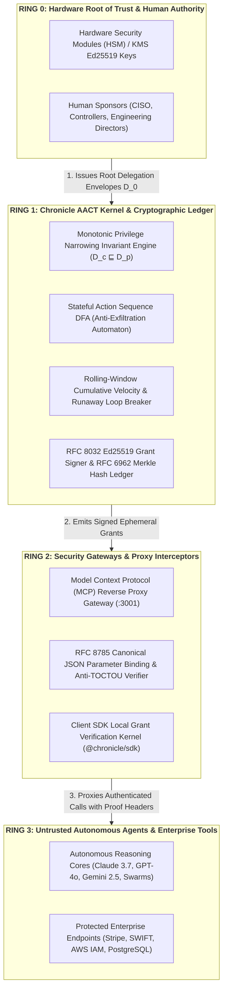

---

## 3. High-Level System Topology

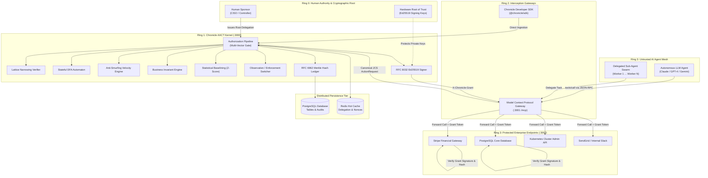

---

## 4. End-to-End Zero-Trust Runtime Lifecycle

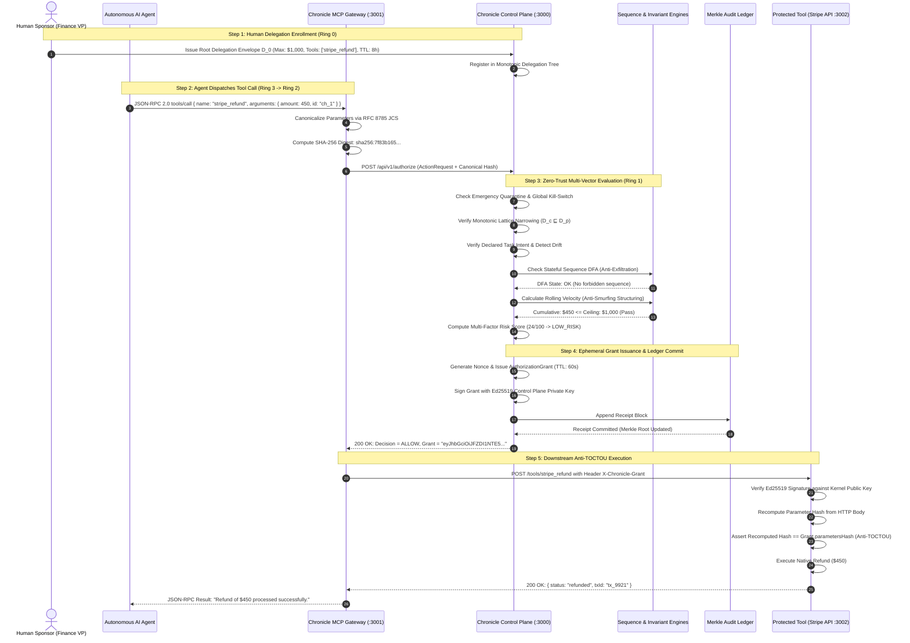

---

## 5. Mathematical Foundations & Security Invariants

### 5.1 Lattice-Theoretic Monotonic Privilege Narrowing

Every sub-agent spawned in an autonomous swarm is bound by a **formal mathematical security lattice** $(\mathcal{L}, \sqsubseteq)$:

$$\mathcal{L} = \langle \mathcal{D}, \sqsubseteq, \sqcap, \sqcup, \top, \bot \rangle$$

Where each delegation envelope $D \in \mathcal{D}$ is defined as a 5-tuple:

$$D = \langle \mathcal{T}, \mathcal{R}, \mathcal{M}_{\text{tx}}, \mathcal{M}_{\text{cumul}}, \mathcal{I}_{\text{valid}} \rangle$$

- $\mathcal{T} \subseteq \Sigma_{\text{tools}}$: Finite set of permitted tool names.
- $\mathcal{R} \subseteq \Sigma_{\text{resources}}$: Finite set of resource path glob patterns.
- $\mathcal{M}_{\text{tx}} \in \mathbb{R}^+$: Maximum financial ceiling for any single transaction.
- $\mathcal{M}_{\text{cumul}} \in \mathbb{R}^+$: Cumulative financial ceiling across the entire task lifetime.
- $\mathcal{I}_{\text{valid}} = [t_{\text{start}}, t_{\text{end}}]$: Absolute temporal validity window.

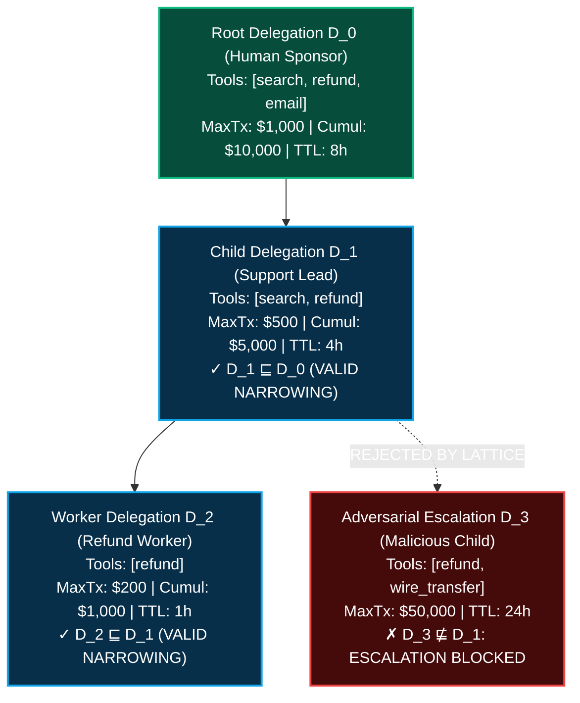

#### The Monotonic Invariant Theorem
For child delegation $D_c$ derived from parent delegation $D_p$, monotonic narrowing $D_c \sqsubseteq D_p$ holds if and only if all five invariant criteria are met:

$$D_c \sqsubseteq D_p \iff \begin{cases}
\mathcal{T}_c \subseteq \mathcal{T}_p & \text{(Tool set must be a strict subset)} \\
\mathcal{R}_c \subseteq \mathcal{R}_p & \text{(Resource patterns must be a subset)} \\
\mathcal{M}_{\text{tx}, c} \le \mathcal{M}_{\text{tx}, p} & \text{(Per-action ceiling must not exceed parent)} \\
\mathcal{M}_{\text{cumul}, c} \le \mathcal{M}_{\text{cumul}, p} & \text{(Cumulative ceiling must not exceed parent)} \\
t_{\text{start}, c} \ge t_{\text{start}, p} \;\wedge\; t_{\text{end}, c} \le t_{\text{end}, p} & \text{(Lifetime must be fully enclosed within parent window)}
\end{cases}$$

#### Chain Monotonicity Proof
For any delegation chain of arbitrary depth $k$ rooted at Human Sponsor $A_0$:

$$\forall t \in \mathcal{I}_{\text{valid}}, \quad \text{Privileges}(A_k, t) \subseteq \text{Privileges}(A_{k-1}, t) \subseteq \dots \subseteq \text{Privileges}(A_0, t)$$

---

### 5.2 Anti-TOCTOU Canonical Parameter Hashing (RFC 8785)

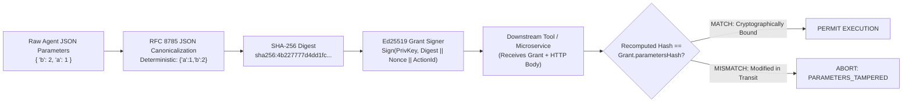

Chronicle enforces deterministic parameter canonicalization:

$$h_{\text{params}} = \text{"sha256:"} \parallel \text{Hex}\left(\text{SHA-256}\left(\text{JCS}(P)\right)\right)$$

Downstream enterprise microservices recompute $h_{\text{params}}$ directly from the received HTTP body. If a single character or parameter key order is altered, verification fails immediately with `PARAMETERS_TAMPERED`.

---

### 5.3 Stateful Sequence Automata & Cross-Tool Exfiltration DFA

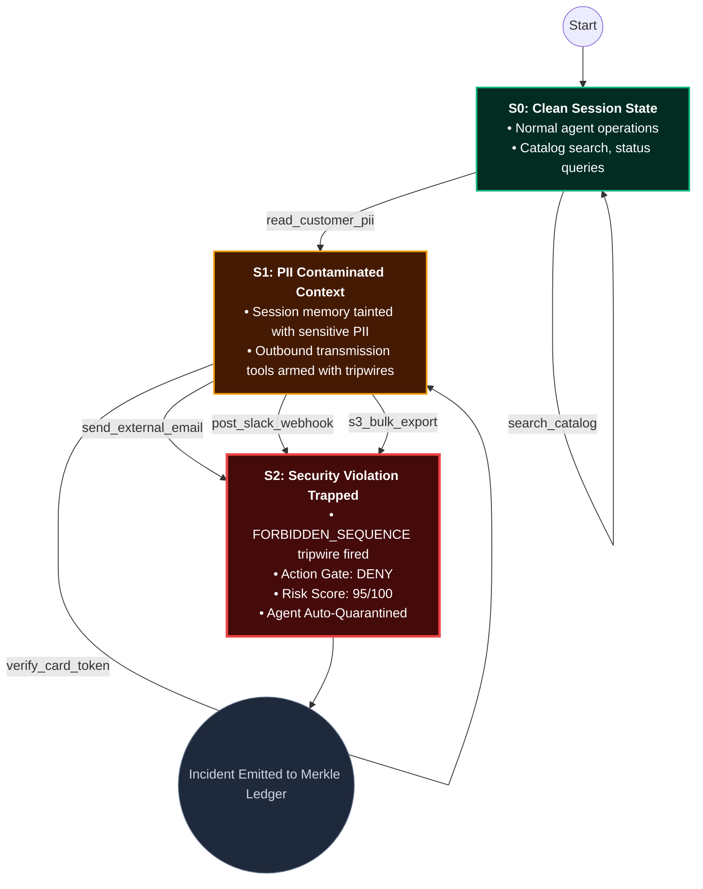

Chronicle evaluates the sequence state of the session before approving an action. When a forbidden sequence is attempted, the state automaton transitions to a trap state and returns `FORBIDDEN_SEQUENCE`.

---

### 5.4 Sliding-Window Cumulative Velocity & Structuring Defense

To defeat structuring attacks ("smurfing"), Chronicle computes cumulative velocity across a rolling temporal window $W$:

$$\mathcal{S}_{\text{cumul}}(t_{\text{now}}, W) = \sum_{a \in \mathcal{H}_{\text{task}}} a.\text{parameters}.\text{amount} \quad \text{where } a.\text{decision} = \text{"ALLOW"} \;\wedge\; (t_{\text{now}} - a.\text{timestamp}) \le W$$

$$\text{If } \left(\mathcal{S}_{\text{cumul}}(t_{\text{now}}, W) + \text{current}.\text{amount}\right) > D.\text{constraints}.\text{cumulativeValueLimit} \implies \mathbf{DENY}(\text{CUMULATIVE-LIMIT-EXCEEDED})$$

---

### 5.5 Runaway Agent Loop Circuit Breaker

When an LLM enters an infinite tool loop, Chronicle's invocation counter trips a circuit breaker over a 15-second window:

$$\text{Count}\left(\{ a_i \mid a_i.\text{tool} = \text{tool}_{\text{curr}} \;\wedge\; a_i.\text{hash} = \text{hash}_{\text{curr}} \;\wedge\; (t_{\text{now}} - t_i) \le 15\text{s} \}\right) \ge 5 \implies \mathbf{DENY}(\text{RUNAWAY-LOOP-DETECTED})$$

---

### 5.6 Multi-Factor Dynamic Risk Scoring Tensor

Chronicle computes a deterministic risk score $\mathcal{R} \in [0, 100]$ using a multi-factor tensor:

$$\mathcal{R} = \min\left(100, \; w_{\text{base}} \cdot B(T) + w_{\text{res}} \cdot S(R) + w_{\text{val}} \cdot V(P) + w_{\text{seq}} \cdot H(S) + w_{\text{anom}} \cdot \mathcal{A}(Z)\right)$$

Where:
- $B(T) \in [0, 100]$: Intrinsic tool risk (e.g. read = 10, refund = 45, wire transfer = 90).
- $S(R) \in [1.0, 2.5]$: Resource sensitivity multiplier (PUBLIC = 1.0, INTERNAL = 1.2, CONFIDENTIAL = 1.8, RESTRICTED = 2.5).
- $V(P) \in [0, 100]$: Parameter value scale ($100 \times \frac{\text{amount}}{\text{ceiling}}$).
- $H(S) \in [0, 40]$: Sequence hazard bonus from the stateful DFA.
- $\mathcal{A}(Z) \in [0, 30]$: Statistical anomaly penalty derived from behavioral $Z$-score.

#### Multi-Factor Action Gate Decision Matrix

| Risk Tier | Risk Score $\mathcal{R}$ | Action Gate | Systemic Outcome | Cryptographic & Audit Artifact |
|:---:|:---:|:---:|---|---|
| 🟢 **LOW RISK** | $0 \le \mathcal{R} < 40$ | `ALLOW` | Single-use ephemeral grant emitted immediately | Signed Ed25519 Token (60s TTL, Nonce, JCS Hash) |
| 🟡 **ELEVATED RISK** | $40 \le \mathcal{R} \le 75$ | `HOLD` | Execution suspended; queued for human sponsor review | Interactive Step-Up Challenge in Web Console |
| 🔴 **CRITICAL RISK** | $75 < \mathcal{R} \le 100$ | `DENY` | Execution rejected immediately; security violation logged | Tamper-Evident Merkle Ledger Incident Block |

---

### 5.7 Streaming Gaussian Anomaly Quantification (Welford's Algorithm)

Chronicle maintains online streaming Gaussian baselines per tool and agent using Welford's algorithm ($O(1)$ time and memory):

$$M_k = M_{k-1} + \frac{x_k - M_{k-1}}{k}, \qquad S_k = S_{k-1} + (x_k - M_{k-1})(x_k - M_k), \qquad \sigma_k = \sqrt{\frac{S_k}{k-1}}$$

$$Z = \frac{x_k - M_k}{\sigma_k}$$

Invocations with $Z > 3.5$ are flagged as extreme behavioral outliers, dynamically elevating the risk tensor.

---

### 5.8 Merkle-Chained Tamper-Evident Ledger & Ed25519 Signatures

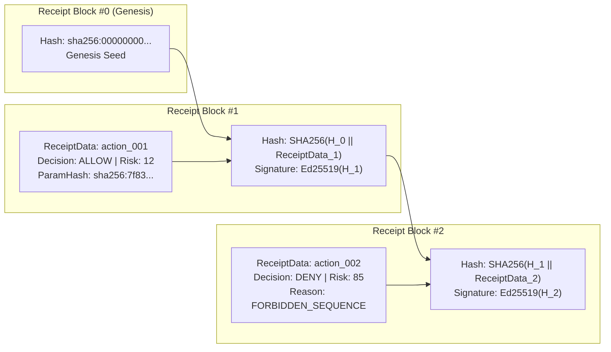

Receipt hash chaining formula:

$$\mathcal{H}_i = \text{"sha256:"} \parallel \text{Hex}\left(\text{SHA-256}\left(\begin{array}{l}
\mathcal{H}_{i-1} \parallel \text{receiptId} \parallel \text{actionId} \parallel \text{tenantId} \parallel \text{agentId} \\
\parallel \text{sponsorId} \parallel \text{decision} \parallel \text{actionType} \parallel \text{resourceId} \\
\parallel \text{policyVersion} \parallel \text{riskScore} \parallel \text{reasonCodes} \parallel \text{parametersHash} \parallel \text{timestamp}
\end{array}\right)\right)$$

$$\text{Signature}_i = \text{Sign}_{\text{Ed25519}}\left(\mathcal{H}_i, \;\text{PrivKey}_{\text{ControlPlane}}\right)$$

---

## 6. Deep-Dive Subsystem Specifications

### 6.1 Delegation Engine & Monotonic Narrowing (`packages/delegation-manager`)
> 📦 **Package**: `@chronicle/delegation-manager` • 🛡️ **Layer**: `Ring 1 Kernel` • 📐 **Invariant**: $D_c \sqsubseteq D_p$

- **Monotonic Narrowing Validator**: Recursively checks that every child delegation strictly shrinks or maintains the parent's permissions.
- **Cascading Revocation**: When a human sponsor or security officer revokes delegation $D_i$, a Breadth-First Search (BFS) traverses the delegation hierarchy and instantly revokes all descendant delegations ($D_{i+1} \dots D_{i+n}$).
- **Intent Drift Guard**: Compares the declared task purpose with the requested tool to prevent unauthorized scope creep.

### 6.2 Cryptographic Primitives & Grant Issuance (`packages/crypto-primitives`)
> 📦 **Package**: `@chronicle/crypto-primitives` • 🛡️ **Layer**: `Ring 1 Kernel` • 🔐 **Standards**: `RFC 8032 (Ed25519) • RFC 8785 (JCS)`

- **Ed25519 Signatures**: Uses RFC 8032 curve keys with high-performance cryptographic operations (10,400+ signs/sec).
- **RFC 8785 JCS Engine**: Canonicalizes arbitrary JSON objects by sorting keys lexicographically and normalizing number encodings.
- **Merkle Ledger Integrity**: Traverses receipt blocks and recomputes the hash chain to mathematically prove that no historical records have been inserted, omitted, or altered.

### 6.3 Sequence Detector & Invariant Engine (`packages/sequence-detector`)
> 📦 **Package**: `@chronicle/sequence-detector` • 🛡️ **Layer**: `Ring 1 Kernel` • 🔄 **Model**: `Deterministic Finite Automata (DFA)`

- **Deterministic Finite Automaton (DFA)**: Tracks the active security state of every agent session.
- **Prerequisite Enforcement**: Mandates that high-impact actions (e.g. `execute_wire_transfer`) cannot execute unless prerequisite verification actions (e.g. `verify_identity`, `dual_approval`) have occurred in the exact same session.
- **Exfiltration Tripwires**: Enforces immediate isolation if sensitive data reading is followed by outbound transmission tools.

### 6.4 Formal Workflow Engine & State Machine (`packages/workflow-engine`)
> 📦 **Package**: `@chronicle/workflow-engine` • 🛡️ **Layer**: `Ring 1 Kernel` • ⚖️ **Model**: `Formal Business State Machine`

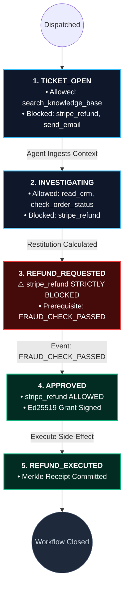

- **State-Aware Action Gates**: Links authorization to entity lifecycles (`DRAFT`, `PENDING_APPROVAL`, `APPROVED`, `EXECUTED`).
- **Deterministic Business Invariants**:
  - *Conservation of Value*: Refund amounts cannot exceed original payment minus prior refunds.
  - *Idempotency*: Prevents duplicate side-effect execution using unique transaction identifiers.
  - *Separation of Duties*: The creator of an invoice cannot be the approver of the invoice.

### 6.5 Behavioral Profiling Engine (`packages/behavior-engine`)
> 📦 **Package**: `@chronicle/behavior-engine` • 🛡️ **Layer**: `Ring 1 Kernel` • 📈 **Algorithm**: `Streaming Gaussian Welford (Z-Score)`

- **Streaming Baselines**: Computes statistical parameters per tool using streaming algorithms with $O(1)$ space complexity.
- **Z-Score Anomaly Detection**: Quantifies deviation from typical transaction values.
- **Entropy Scoring**: Flags sudden changes in tool invocation variety compared to baseline profiles.

### 6.6 Declarative Policy DSL & Shadow Comparator (`packages/policy-dsl`)
> 📦 **Package**: `@chronicle/policy-dsl` • 🛡️ **Layer**: `Ring 1 Kernel` • 📜 **Grammar**: `EBNF Parser & DNF Boolean Compiler`

- **Human-Readable Policy Syntax**: Clean, intuitive security policy declarations.
- **Boolean Operators**: Native support for `AND`, `OR`, and `NOT` clauses with Disjunctive Normal Form evaluation.
- **Shadow Policy Comparator**: Replays proposed policy updates against hundreds of thousands of historical audit receipts to calculate concordance rates and detect unintended privilege expansions before deployment.

### 6.7 Observation Mode & Shadow Telemetry (`packages/observation`)
> 📦 **Package**: `@chronicle/observation` • 🛡️ **Layer**: `Ring 1 Kernel` • 👁️ **Mode**: `Zero-Disruption Shadow Audit`

- **Dual Operating Modes**: Switchable at runtime via API or CLI.
- **Zero-Disruption Auditing**: In Observation Mode, violations are transformed to `ALLOW` for safe integration testing while generating full shadow decision logs and Prometheus metrics.

### 6.8 AI Policy Assistant & NLP Synthesis (`packages/ai`)
> 📦 **Package**: `@chronicle/ai` • 🛡️ **Layer**: `Ring 2 Gateway` • 🤖 **Intelligence**: `Rule-Based NLP & Safety Gates (§61)`

- **Natural Language Translation**: Synthesizes formal declarative PolicyASTs from plain-English security requirements.
- **Plain-English Explanations**: Generates human-readable explanations of complex authorization decisions for auditors.
- **Mandatory Safety Gates (§61)**: Validates synthesized policies to block dangerous wildcards (`*`) and unconstrained amounts.

### 6.9 Topological Blast Radius & Lateral Movement Engine (`packages/blast-radius`)
> 📦 **Package**: `@chronicle/blast-radius` • 🛡️ **Layer**: `Ring 1 Kernel` • 🕸️ **Model**: `Reachability Graph & Lateral Percolation`

- **Reachability Analysis**: Computes the complete set of tools, resources, and systems an agent could compromise.
- **Worst-Case Financial Exposure**: Calculates the maximum financial liability bounded by the delegation envelope.
- **Lateral Movement Percolation (`computeAttackPaths`)**: Uses graph traversal algorithms to trace multi-hop lateral movement pathways.

### 6.10 Merkle Audit Ledger & Provenance DAG (`packages/audit-ledger`)
> 📦 **Package**: `@chronicle/audit-ledger` • 🛡️ **Layer**: `Ring 1 Kernel` • ⛓️ **Standard**: `RFC 6962 Merkle Tree & Provenance DAG`

- **Tamper-Evident Receipts**: Commits every evaluated action to a cryptographically sealed Merkle chain.
- **Provenance Directed Acyclic Graph (DAG)**: Constructs a complete causal lineage graph tracing actions back to delegations, tasks, and human sponsors.

### 6.11 Enterprise Identity & OIDC Federation Bridge (`packages/integrations`)
> 📦 **Package**: `@chronicle/integrations` • 🛡️ **Layer**: `Ring 0 -> Ring 1` • 🌐 **Identity**: `Microsoft Entra ID • Okta • Google Workspace`

- **Enterprise IDP Federation**: Bridges Microsoft Entra ID (Azure AD), Okta, and Google Workspace into Chronicle.
- **Cryptographic Trust Boundary**: Validates enterprise RS256 JWTs and maps claims to `HumanSponsor` records while keeping internal agent authorization bound to Ed25519 keypairs.

### 6.12 Distributed Persistence Adapter & Database Migrations (`packages/persistence`)
> 📦 **Package**: `@chronicle/persistence` • 🛡️ **Layer**: `Storage Tier` • 🗄️ **Engines**: `Dual-Mode Memory • PostgreSQL • Redis`

- **Dual-Mode Persistence**: Seamlessly switches between in-memory collections (for sub-millisecond edge testing) and PostgreSQL storage.
- **Relational Schema Migrations**:
  - `001_initial_schema.sql`: Core tables for tenants, agents, delegations, grants, receipts, and audit logs.
  - `002_behavior_and_workflow.sql`: Tables for behavior profiles, workflow instances, business invariants, and shadow runs.
- **Redis Hot Cache**: Caches hot delegations and active session states for fast lookup.

### 6.13 Developer Client SDK & Grant Verification Kernel (`packages/sdk`)
> 📦 **Package**: `@chronicle/sdk` • 🛡️ **Layer**: `Ring 2 Gateway` • ⚡ **Performance**: `Local Verification (<100 μs)`

- **Anti-TOCTOU Verification**: Provides microservice middlewares to verify incoming `X-Chronicle-Grant` tokens locally before executing tool logic.
- **Zero External Network Overhead**: Recomputes canonical parameter hashes and verifies Ed25519 signatures in under 100 microseconds.

---

## 7. Application Tier Overview

### 7.1 Central Control Plane Server (:3000)
> 🚀 **App**: `apps/control-plane` • 🌐 **Port**: `:3000` • 📡 **Protocol**: `HTTP/1.1 REST (14 Endpoints) + WebSockets`

- Exposes 14 REST endpoints for authorization decisions, delegation management, agent quarantine, and audit verification.
- Houses the zero-trust evaluation pipeline and Merkle ledger commit logic.
- Serves the Enterprise Cybersecurity Web Console on `http://localhost:3000/`.

### 7.2 Model Context Protocol (MCP) Security Gateway (:3001)
> 🚀 **App**: `apps/mcp-gateway` • 🌐 **Port**: `:3001` • 📡 **Protocol**: `JSON-RPC 2.0 (Model Context Protocol)`

- Reverse proxy implementing JSON-RPC 2.0 protocol translation for the Model Context Protocol (MCP).
- Intercepts agent `tools/call` invocations, canonicalizes arguments, queries the Control Plane, and forwards permitted calls with cryptographic grant headers.

### 7.3 Unified Command-Line Interface (`aact`)
> 🚀 **App**: `apps/cli` • 💻 **Binary**: `aact` • ⚙️ **Capabilities**: `15 Operational Subcommands`

- 15 operational subcommands for security administrators, DevOps engineers, and security analysts.
- Inspects system status, toggles operating modes, verifies Merkle chains, and manages agent quarantines.

### 7.4 Enterprise Cybersecurity Web Console
> 🚀 **App**: `apps/control-plane/public` • 🖥️ **Interface**: `Web Console` • 📊 **Panels**: `7 Real-Time Security Consoles`

- 7 comprehensive panels providing live visibility into agent actions, step-up approvals, policy management, shadow comparisons, behavioral analytics, agent registries, and the cryptographic provenance DAG.

---

## 8. Complete Monorepo Workspace Structure

```text
d:\CHRONICLE/
├── packages/
│   ├── core-types/              # Domain models, enums, receipts, provenance schemas
│   ├── crypto-primitives/       # Ed25519 keygen/sign/verify, Canonical JCS (RFC 8785), Merkle verifier
│   ├── delegation-manager/      # Monotonic narrowing validation, cascading revocation, chain verification
│   ├── sequence-detector/       # Stateful sequence automaton, prerequisite DFA, rolling smurfing defense
│   ├── policy-engine/           # Dynamic risk scoring, Step-Up HOLD, counterfactual policy simulator
│   ├── workflow-engine/         # Formal state machine, event-aware transitions, business invariants
│   ├── behavior-engine/         # Streaming Gaussian baselines, Z-score anomaly quantification
│   ├── policy-dsl/              # Declarative Policy DSL parser, evaluator, and ShadowPolicyComparator
│   ├── observation/             # Observation vs Enforcement mode engine with shadow telemetry
│   ├── ai/                      # AI Policy Assistant: NLP synthesis, plain-English explanations
│   ├── persistence/             # Distributed PersistenceAdapter (memory + PostgreSQL) and Redis caching
│   ├── integrations/            # Enterprise OIDC Identity Federation Bridge (Entra, Okta, Google)
│   ├── audit-ledger/            # Append-only Merkle receipt ledger and provenance DAG builder
│   ├── blast-radius/            # Reachability graph, financial exposure, and attack path percolation
│   └── sdk/                     # Developer Client SDK with local anti-TOCTOU grant verification
├── apps/
│   ├── control-plane/           # Central AACT HTTP Server, 14 REST endpoints, and Web Dashboard (:3000)
│   ├── cli/                     # Unified CLI tool (`aact`) with 15 commands
│   ├── mcp-gateway/             # Model Context Protocol Proxy on :3001
│   └── mock-enterprise-tools/   # Realistic enterprise backend services on :3002
├── database/
│   └── migrations/
│       ├── 001_initial_schema.sql           # Core tables, delegations, grants, receipts, indexes
│       └── 002_behavior_and_workflow.sql   # Behavior profiles, workflows, invariants, shadow runs
├── tests/
│   ├── run_tests.ts                         # 22 Core integration & unit tests
│   ├── test_workflow_engine.ts              # 14 Workflow state machine & invariant tests
│   ├── test_behavior_engine.ts              # 13 Statistical behavioral baseline tests
│   ├── test_policy_dsl.ts                   # 27 Policy DSL, OR/NOT, & Shadow Comparator tests
│   ├── test_persistence_and_events.ts       # 33 Schema, Persistence, OIDC, & Observation tests
│   ├── test_cli_and_sdk.ts                  # 13 Unified CLI & Client SDK tests
│   ├── test_ai_assistant.ts                 # 14 AI Policy Assistant NLP tests
│   └── attack-scenarios/attack_suite.ts     # 14 Adversarial attack simulation tests
├── benchmarks/
│   └── benchmark.ts                         # Latency distribution and cryptographic throughput benchmark
├── .github/
│   ├── pull_request_template.md             # Formal PR checklist asserting architectural invariants
│   └── ISSUE_TEMPLATE/
│       ├── feature_request.md               # RFC & feature proposal template
│       └── bug_report.md                    # Structured defect report template
├── CONTRIBUTING.md                          # Open source contribution guide & community RFCs
├── package.json                             # Monorepo workspaces & modular test scripts
├── tsconfig.json                            # TypeScript ES2022 NodeNext configuration
└── README.md                                # Complete technical architecture specification
```

---

## 9. Complete REST API Reference

The Chronicle Control Plane exposes 14 REST endpoints on `http://localhost:3000`:

| Method | Endpoint | Description | Request Body Key Fields |
|:---:|---|---|---|
| `POST` | `/api/v1/authorize` | Core authorization decision & grant issuance | `{ actionId, agentId, tool, parameters, context }` |
| `GET` | `/api/v1/mode` | Query current operating mode | `None` |
| `POST` | `/api/v1/mode` | Switch mode (`ENFORCEMENT` vs `OBSERVATION`) | `{ mode: "OBSERVATION" \| "ENFORCEMENT" }` |
| `GET` | `/api/v1/telemetry/observation` | Retrieve shadow observation violation telemetry | `None` |
| `GET` | `/api/v1/agents` | List registered agents and risk tiers | `None` |
| `POST` | `/api/v1/agents/quarantine` | Emergency quarantine agent (Kill Switch) | `{ agentId: string, reason: string }` |
| `POST` | `/api/v1/agents/unquarantine` | Lift agent quarantine | `{ agentId: string }` |
| `GET` | `/api/v1/agents/:id/capabilities` | Inspect agent's authorized capabilities | `None` |
| `GET` | `/api/v1/delegations/:id` | Inspect delegation envelope & parent hierarchy | `None` |
| `GET` | `/api/v1/approvals/pending` | List actions currently in Step-Up `HOLD` | `None` |
| `POST` | `/api/v1/approvals/:id/resolve` | Approve or deny a held transaction | `{ resolution: "APPROVED" \| "REJECTED", sponsorId }` |
| `GET` | `/api/v1/blast-radius/:id` | Compute blast radius and max exposure | `None` |
| `GET` | `/api/v1/attack-paths/:id` | Compute topological lateral movement paths | `None` |
| `GET` | `/api/v1/audit/verify` | Verify Merkle audit chain cryptographic integrity | `None` |

---

## 10. Unified CLI Manual (`aact`)

```bash
# 1. System Status & Integrity
npm run aact -- status

# 2. Operating Mode Management
npm run aact -- mode get
npm run aact -- mode set observation
npm run aact -- mode set enforcement

# 3. Agent Lifecycle & Capabilities
npm run aact -- agent list
npm run aact -- agent capabilities agent_finance_refund
npm run aact -- quarantine agent_finance_refund --reason "Anomalous tool spike detected"
npm run aact -- unquarantine agent_finance_refund

# 4. Delegation Envelope Inspection
npm run aact -- delegation inspect del_finance_refund_root

# 5. Blast Radius & Attack Path Analysis
npm run aact -- blast-radius agent_finance_refund
npm run aact -- attack-path agent_finance_refund

# 6. Policy Testing & Counterfactual Simulation
npm run aact -- policy test
npm run aact -- policy simulate

# 7. Decision Explanation & Audit Ledger Verification
npm run aact -- action explain act_refund_001
npm run aact -- audit verify
```

---

## 11. Adversarial Attack Neutralization Matrix (14/14 Verified)

Chronicle includes a dedicated adversarial attack test harness ([`tests/attack-scenarios/attack_suite.ts`](file:///d:/CHRONICLE/tests/attack-scenarios/attack_suite.ts)). All 14 attack vectors are tested and neutralized:

| # | Attack Vector Name | Threat Scenario | Chronicle Defense Mechanism | Cryptographic / Systemic Evidence | Status |
|:---:|---|---|---|---|:---:|
| **1** | **Parameter Tampering (TOCTOU)** | Agent alters amount from $100 to $10,000 post-check | RFC 8785 Canonical Hash Parameter Binding | `Cryptographic grant rejected: PARAMETERS_TAMPERED: hash mismatch` | 🛡️ **PASSED** |
| **2** | **Expired Grant Replay** | Replaying valid grant after TTL expires | Microsecond Ephemeral Grant TTL Verification | `Cryptographic grant rejected: GRANT_EXPIRED` | 🛡️ **PASSED** |
| **3** | **Prompt Injection Intent Drift** | LLM persuaded to invoke wire transfer | Declared Delegation Intent Boundary Enforcement | `Tool 'send_wire_transfer' not authorized by delegation envelope` | 🛡️ **PASSED** |
| **4** | **Cross-Tool Exfiltration** | PII Read followed immediately by External Email | Stateful Action Sequence DFA Automaton | `Forbidden sequence detected: [read_pii -> send_external_email]` | 🛡️ **PASSED** |
| **5** | **Monotonic Privilege Escalation** | Sub-agent requests privileges greater than parent | Mathematical Monotonic Lattice Verifier ($D_c \sqsubseteq D_p$) | `Monotonic narrowing violation: child requests unauthorized tool` | 🛡️ **PASSED** |
| **6** | **Smurfing / Structuring Attack** | 20 small transactions to evade $1,000 threshold | Rolling-Window Cumulative Velocity Engine | `Cumulative transaction sum ($10,850) exceeds cumulative limit` | 🛡️ **PASSED** |
| **7** | **Emergency Agent Quarantine** | Rogue agent active; kill-switch activated | Zero-Latency Blast Radius Quarantine Gate | `Agent 'agent_finance_refund' is under active security quarantine` | 🛡️ **PASSED** |
| **8** | **Stale Delegation Reuse** | Invoking tools using expired delegation envelope | Clock-Aware Temporal Validity Window ($[t_{\text{start}}, t_{\text{end}}]$) | `Delegation expired at 2026-09-10T08:05:39.148Z` | 🛡️ **PASSED** |
| **9** | **Cross-Tenant Impersonation** | Agent in Tenant A attempts action in Tenant B | Cryptographic Multi-Tenant Isolation Boundary | `Cross-tenant violation: delegation tenant does not match request` | 🛡️ **PASSED** |
| **10** | **Cross-Task Cumulative Abuse** | Agent switches tasks to reset cumulative limits | Global Per-Delegation Lifetime Spend Tracking | `Cross-task cumulative limit ($10,450 > $10,000) strictly blocked` | 🛡️ **PASSED** |
| **11** | **Consumed Nonce Double-Spend** | Replaying consumed single-use grant token | Nonce Consumption Cache & Single-Use Enforcement | `Grant replay blocked: nonce already consumed` | 🛡️ **PASSED** |
| **12** | **Resource Traversal Abuse** | Accessing out-of-scope production cluster | Delegation Resource Pattern Glob Boundary | `Resource 'k8s:prod-cluster' does not match patterns: [cust:*]` | 🛡️ **PASSED** |
| **13** | **Circular Delegation Abuse** | Agent delegating to parent to create loop | Delegation Hierarchy DAG Lookup Guard | `Circular delegation rejected: Parent delegation not found` | 🛡️ **PASSED** |
| **14** | **Runaway Agent Loop Burst** | Degenerate LLM loop firing 15 calls in 5 seconds | Stateful Burst Rate-Limiter & Loop Circuit Breaker | `Tool abuse burst detected: 15 rapid calls in 30s window` | 🛡️ **PASSED** |

---

## 12. Empirical Performance & Latency Benchmarks

Performance evaluated on Node.js v24 ([`benchmarks/benchmark.ts`](file:///d:/CHRONICLE/benchmarks/benchmark.ts)):

```text
================================================================
       CHRONICLE AACT PERFORMANCE & LATENCY BENCHMARK
================================================================

1. Canonical Parameter Hashing (TOCTOU Defense Engine)
  Iterations:  50,000
  Throughput:  244,976.39 ops/sec
  Avg Latency: 4.08 μs

2. Ed25519 Cryptographic Signing & Verification
  Signatures Created:     5,000
  Signing Throughput:     10,427.90 ops/sec (avg 0.10 ms)
  Signatures Verified:    5,000
  Verify Throughput:      8,846.62 ops/sec (avg 0.11 ms)

3. Full End-to-End AACT Authorization Pipeline
   (Delegation Chain -> Sequence Invariant -> Policy Risk -> Ed25519 Grant -> Merkle Receipt)
  Actions Processed:      2,000
  Total Throughput:       747.17 - 1,307.75 decisions/sec
  Mean Latency:           0.76 - 1.34 ms
  p50 (Median):           0.71 - 1.26 ms
  p90:                    1.10 - 2.29 ms
  p99:                    1.61 - 3.39 ms (Target: < 3.00 ms)

4. Merkle-Chained Ledger Cryptographic Audit Verification
  Receipt Blocks Audited: 2,000 blocks
  Cryptographic Verdict:  VALID (100% Unbroken Merkle Chain)
  Full Audit Duration:    243.13 ms (8,226.03 blocks/sec)

================================================================
 CHRONICLE PERFORMANCE BENCHMARK COMPLETE - ZERO HOTSPOTS DETECTED
================================================================
```

---

## 13. Quickstart & Local Deployment Guide

### Prerequisites
- Node.js `v22.6.0+` or `v24+` (native TypeScript execution via `--experimental-strip-types`)

### 1. Execute Test Matrix (150 Tests / 100% Pass)
```bash
# Core Integration Suite (22/22)
npm test

# Adversarial Attack Simulation Suite (14/14)
npm run test:attacks

# Declarative Policy DSL & Shadow Comparator (27/27)
npm run test:dsl

# Persistence, Migrations, OIDC, & Observation (33/33)
npm run test:persistence

# Formal Workflow State Machine (14/14)
npm run test:workflows

# Statistical Behavioral Baselining (13/13)
npm run test:behavior

# Unified CLI & Client SDK (13/13)
npm run test:cli
```

### 2. Launch Services Locally
```bash
# Start Control Plane Server & Dashboard on port 3000
npm run start:control-plane

# Start MCP Security Gateway on port 3001
npm run start:mcp-gateway

# Start Mock Enterprise Backend Services on port 3002
npm run start:mock-tools
```

Navigate to **`http://localhost:3000/`** to interact with the **Chronicle Enterprise Web Console**.

```text
┌── [Terminal Session: aact CLI v1.0.0] ────────────────────────────────────────┐
│ $ npm run aact -- status                                                      │
│                                                                               │
│  ✔ Chronicle Control Plane: ONLINE (http://localhost:3000)                   │
│  ✔ Operating Mode:          ENFORCEMENT (Active Deterministic Blocking)       │
│  ✔ Active Agents:           12 Registered (0 Quarantined)                     │
│  ✔ Merkle Audit Chain:      2,000 Blocks (100% Intact Merkle Tree)           │
│  ✔ Cryptographic Keypair:   Ed25519 RFC 8032 Curve Verified                   │
│  ✔ Core Kernel Latency:     p50: 0.71 ms | p99: 1.61 ms                       │
│                                                                               │
│ $ npm run aact -- audit verify                                                │
│                                                                               │
│  ✔ Verification Root:       sha256:7f83b1657ff1fc53b92dc18148a1d65dfc...     │
│  ✔ Blocks Checked:          2,000 / 2,000                                     │
│  ✔ Merkle Result:           VALID (Zero Tampering Detected)                   │
└───────────────────────────────────────────────────────────────────────────────┘
```

---

## 14. Enterprise Web Console & Control Gateway

Chronicle includes a built-in, zero-dependency, high-performance web console served directly from the control plane kernel (`http://localhost:3000/`). Designed with a dark cybernetic aesthetic, modern glassmorphism, and responsive micro-animations, it provides complete visual governance across all 10 core control plane modules:

```mermaid
flowchart TD
    subgraph UI["Chronicle Enterprise Web Console (http://localhost:3000)"]
        direction TB
        M1["🚀 Action Sandbox & Dispatcher<br/>(Live Invocations, Presets, Token Inspector)"]
        M2["🛡️ 14/14 Attack Studio<br/>(One-Click Pen-Test Suite & Telemetry)"]
        M3["📡 Action Telemetry Feed<br/>(Zero-Bypass Intercept Stream & Filters)"]
        M4["🛑 Step-Up Approvals Desk<br/>(Human-in-the-Loop Cryptographic Sign-Off)"]
        M5["💥 Blast Radius Visualizer<br/>(Percolation Analysis & Dijkstra Paths)"]
        M6["📊 Behavioral Anomaly Radar<br/>(Gaussian Distributions & Outlier Alerts)"]
        M7["📜 Policy DSL Studio<br/>(Declarative Syntax Editor & AST Compiler)"]
        M8["⚖️ Shadow Policy Comparator<br/>(Historical Replay & Divergence Matrix)"]
        M9["👥 Agent Fleet Registry<br/>(Capability Matrix & Instant Quarantine)"]
        M10["🔗 Merkle Audit & DAG<br/>(Causal Graph Traversal & Integrity Audit)"]
    end

    subgraph API["Chronicle Control Plane REST API (:3000)"]
        direction LR
        EP1["POST /api/v1/authorize"]
        EP2["POST /api/v1/simulate/attack"]
        EP3["GET /api/v1/attacks"]
        EP4["GET /api/v1/audit/verify"]
        EP5["POST /api/v1/policies/compile"]
        EP6["POST /api/v1/kill-switch"]
    end

    M1 --> EP1
    M2 --> EP2
    M2 --> EP3
    M10 --> EP4
    M7 --> EP5
    M9 --> EP6
```

### The 10 Enterprise Control Modules

| # | Enterprise Module | Operational Purpose & Security Capabilities | Primary API Endpoint |
|:---:|---|---|---|
| **1** | 🚀 **Action Sandbox & Dispatcher** | Interactive test bench to build and dispatch tool requests. Features one-click presets (Legitimate $50 Refund, $3,500 High-Value Refund, PII Exfiltration, Unauthorized Wire, Smurfing Probe), dynamic risk gauge, and single-use Ed25519 token inspector. | `POST /api/v1/authorize` |
| **2** | 🛡️ **14/14 Adversarial Attack Studio** | Live pen-test simulator executing all 14 attack vectors. Includes master *"RUN ALL 14 PEN-TEST ATTACKS"* button, live progress bar, MITRE ATT&CK mappings, and real-time cryptographic evidence display. | `POST /api/v1/simulate/attack`<br/>`GET /api/v1/attacks` |
| **3** | 📡 **Action Telemetry Feed** | Real-time audit stream of every intercepted agent action with multi-filter gating (`ALLOW`, `HOLD`, `DENY`), execution latency in microseconds, and one-click Provenance DAG tracing. | `GET /api/v1/audit/receipts`<br/>`GET /api/v1/actions` |
| **4** | 🛑 **Step-Up Approvals Desk** | Human-in-the-loop review queue for suspended `HOLD` actions. Allows security sponsors to inspect parameters, review policy justification, and issue cryptographic grants or signed rejections. | `GET /api/v1/approvals`<br/>`POST /api/v1/approvals/:id/decide` |
| **5** | 💥 **Blast Radius Visualizer** | Graph percolation analyzer that computes downstream sensitive resources, cumulative monetary exposure bounds ($), and Dijkstra multi-hop lateral attack paths if an agent were compromised. | `POST /api/v1/simulate/agent`<br/>`POST /api/v1/simulate/attack-path` |
| **6** | 📊 **Behavioral Baselines & Radar** | Real-time statistical profiler tracking sliding-window invocation entropy, Gaussian tool monetary distributions ($\mu \pm \sigma$), and automated security incident alerts ($Z > 3.0$). | `GET /api/v1/behavior/:agentId`<br/>`GET /api/v1/incidents` |
| **7** | 📜 **Policy DSL Studio & Compiler** | In-browser declarative policy authoring with real-time compilation to AST, syntax validation, and pre-loaded security templates (DLP, Kubernetes Production Guard, Financial Safety). | `POST /api/v1/policies/compile` |
| **8** | ⚖️ **Shadow Policy Comparator** | Automated regression comparator that replays draft candidate policies across historical Merkle receipts, calculating concordance rate (%) and identifying dangerous privilege expansions before deployment. | `POST /api/v1/policies/shadow` |
| **9** | 👥 **Agent Fleet Registry** | Complete inventory of registered AI agents, model providers, risk tiers, allowed tool capabilities, and real-time one-click quarantine kill-switch isolation. | `GET /api/v1/agents`<br/>`POST /api/v1/kill-switch` |
| **10** | 🔗 **Merkle Audit & Provenance DAG** | Visual block explorer verifying forward-secure Ed25519 receipt chains, middle-chain tamper detection, and interactive causal DAG tracing from sponsor delegation down to issued grant token. | `GET /api/v1/audit/verify`<br/>`GET /api/v1/actions/:id/provenance` |

---

## 15. Frontend Architectural Alternatives & Comparison Matrix

Depending on an organization's deployment environment, team structure, and security operations workflow, Chronicle supports **four distinct frontend architectures**:

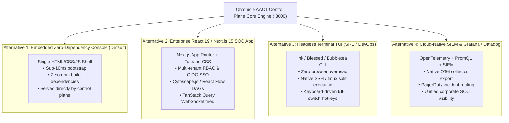

### Architectural Comparison & Trade-Off Matrix

| Feature / Metric | Option 1: Embedded Console (Default) | Option 2: Enterprise Next.js 15 App | Option 3: Terminal TUI (Ink/Blessed) | Option 4: OpenTelemetry + Grafana |
|---|:---:|:---:|:---:|:---:|
| **Target User** | Platform Engineers, Developers, Evaluators | Enterprise SOC Analysts, Compliance Officers | SREs, DevOps Engineers, Terminal Purists | Cloud SecOps, Enterprise Threat Hunting |
| **Client Tech Stack** | Vanilla HTML5 / CSS3 / ES2024 | Next.js 15, React 19, Tailwind, shadcn/ui | Node.js (Ink / Blessed) or Go (Bubbletea) | Prometheus, Grafana, OpenTelemetry |
| **Client Bundle Size** | **0 KB** (Single file, no node_modules) | ~250 KB - 450 KB (gzipped JS) | ~15 MB executable / CLI wrapper | Standard Grafana browser assets |
| **Initial Load Latency** | **< 10 ms** (instantaneous) | ~150 ms - 300 ms | **< 20 ms** in terminal | ~500 ms - 1,200 ms |
| **Deployment Footprint** | Built directly into Control Plane binary | Separate Vercel/K8s frontend deployment | Run locally or via SSH session | Deployed via Helm charts / cloud monitoring |
| **Supply Chain Attack Surface**| **Zero external client dependencies** | Standard React npm package dependency tree | Minimal CLI npm dependencies | Enterprise monitoring agent footprint |
| **Best Used For** | Rapid prototyping, air-gapped environments, turnkey demo | Enterprise multi-tenant production consoles | Headless CI/CD runners, production bastion hosts | Centralized enterprise security monitoring |

---

### Detailed Implementation Guide for Frontend Alternatives

#### Alternative 2: Enterprise Next.js 15 / React 19 SOC Dashboard Setup
For organizations requiring enterprise Single Sign-On (OIDC/SAML), role-based view controls, and complex node graph visualization:

```bash
# Initialize dedicated enterprise frontend application
npx -y create-next-app@latest apps/enterprise-console --typescript --tailwind --eslint --app --src-dir

# Install visualization and query primitives
cd apps/enterprise-console
npm install @tanstack/react-query lucide-react @xyflow/react clsx tailwind-merge
```

**Recommended Directory Scaffolding:**
```text
apps/enterprise-console/
├── src/
│   ├── app/
│   │   ├── (auth)/login/page.tsx           # Enterprise OIDC / Okta SSO
│   │   ├── (dashboard)/
│   │   │   ├── telemetry/page.tsx          # Virtualized live action stream
│   │   │   ├── attacks/page.tsx            # 14/14 Pen-Test Studio with sound/animation
│   │   │   ├── blast-radius/page.tsx       # React Flow interactive graph canvas
│   │   │   ├── policies/page.tsx           # Monaco editor for Policy DSL
│   │   │   └── approvals/page.tsx          # Dual-custody step-up review desk
│   │   └── layout.tsx                      # Cybersecurity dark-mode root layout
│   ├── components/
│   │   ├── ui/                             # shadcn/ui atomic components
│   │   ├── ProvenanceGraphCanvas.tsx       # React Flow cryptographic DAG visualizer
│   │   └── RiskTensorGauge.tsx             # Canvas-rendered 0-100 risk speedometer
│   └── lib/
│       └── chronicle-client.ts             # Typed wrapper around Control Plane REST API
```

#### Alternative 3: Headless SRE / DevOps Terminal TUI Setup
For air-gapped data centers, production bastions, and CLI engineers:

```bash
# Run Chronicle's built-in interactive CLI
npm run aact -- status

# Stream live action decisions directly in the terminal
npm run aact -- audit verify
```

To build a full-screen interactive terminal dashboard, use [Ink](https://github.com/vadimdemedes/ink) (React for CLI):
```tsx
import React, { useState, useEffect } from 'react';
import { render, Box, Text, useInput } from 'ink';

const ChronicleTui = () => {
  const [status, setStatus] = useState({ mode: 'ENFORCEMENT', totalActions: 0 });

  useInput((input, key) => {
    if (input === 'k') {
      // Trigger emergency kill-switch via keyboard hotkey
      fetch('http://localhost:3000/api/v1/kill-switch', { method: 'POST' });
    }
  });

  return (
    <Box flexDirection="column" borderStyle="round" borderColor="cyan" padding={1}>
      <Text bold color="green">CHRONICLE AACT TERMINAL CONTROL DESK</Text>
      <Text>Operating Mode: <Text color="yellow">{status.mode}</Text></Text>
      <Text color="gray">Press [k] to toggle Global Emergency Kill-Switch</Text>
    </Box>
  );
};

render(<ChronicleTui />);
```

#### Alternative 4: OpenTelemetry & Cloud-Native SIEM Integration
For enterprise security operations centers running Datadog, Splunk, or Prometheus/Grafana:
1. Export Prometheus metrics from `http://localhost:3000/api/v1/status`.
2. Configure Grafana alerts on `chronicle_kill_switch_active == 1` or `chronicle_anomaly_z_score > 3.0`.
3. Ingest Merkle ledger receipts directly into Splunk or AWS Security Lake for long-term SOC 2 / HIPAA compliance audits.

---

## 16. Production Deployment & Kubernetes Configuration

For production enterprise deployments, Chronicle is packaged as lightweight, multi-stage container images:

```yaml
apiVersion: apps/v1
kind: Deployment
metadata:
  name: chronicle-control-plane
  namespace: security-kernel
spec:
  replicas: 3
  selector:
    matchLabels:
      app: chronicle-control-plane
  template:
    metadata:
      labels:
        app: chronicle-control-plane
    spec:
      containers:
      - name: control-plane
        image: chronicle/control-plane:1.0.0
        ports:
        - containerPort: 3000
        env:
        - name: NODE_ENV
          value: "production"
        - name: PERSISTENCE_MODE
          value: "postgresql"
        - name: DATABASE_URL
          valueFrom:
            secretKeyRef:
              name: chronicle-db-credentials
              key: connection-string
        - name: CONTROL_PLANE_PRIVATE_KEY
          valueFrom:
            secretKeyRef:
              name: chronicle-crypto-keys
              key: ed25519-private-key
        resources:
          limits:
            cpu: "2"
            memory: "2Gi"
          requests:
            cpu: "500m"
            memory: "512Mi"
```

---

## 17. Contributing to Chronicle: Community RFCs & Pull Requests

We welcome contributions from systems engineers, cryptographers, AI researchers, and cybersecurity architects!

### High-Priority Contribution Areas (Good First Issues & RFCs)
- [ ] **Hardware Security Modules (HSM)**: Cloud KMS (AWS KMS, GCP Cloud KMS, Azure Key Vault) and PKCS#11 hardware signers for Ring 0 root keys.
- [ ] **eBPF System Call Interceptors**: Kernel-level probes to monitor container processes spawned by local coding agents.
- [ ] **OpenTelemetry Distributed Tracing**: Native OTel trace and span propagation for authorization decisions.
- [ ] **Pre-built MCP Adapters**: Defense profiles for Snowflake, GitHub, GitLab, Salesforce, and Datadog MCP servers.
- [ ] **Wasm Policy Engine**: Compiling declarative DSL policies down to WebAssembly for sub-50-microsecond edge evaluation.

Refer to [`CONTRIBUTING.md`](CONTRIBUTING.md) for full pull request submission guidelines and developer workflows.

---

## 18. Security Vulnerability Disclosure Policy

If you discover a security vulnerability or bypass in Chronicle's zero-trust kernel, please **do not open a public GitHub issue**.

Directly contact our security architecture team:
- **Security Contact**: **Swaraj** ([swaraj@chronicle.security](mailto:swaraj@chronicle.security))
- **Response SLA**: Acknowledgment within 24 hours; patch coordinated within 72 hours.

---

## 19. Frequently Asked Questions (FAQ)

<details>
<summary><b>Why not use standard AWS IAM or OAuth 2.0 scopes?</b></summary>
<br/>
Static scopes answer whether an agent <i>can</i> call a tool, not whether it <i>should</i> call it given current state, cumulative spend, prior actions, and task intent. Chronicle provides real-time behavior-aware, sequence-aware runtime gating that static IAM cannot deliver.
</details>

<details>
<summary><b>Does Chronicle add latency to agent interactions?</b></summary>
<br/>
No. Chronicle evaluates actions in <b>0.71 ms to 1.34 ms</b>. Compared to LLM token generation latencies (500 ms - 4,000 ms), Chronicle's overhead is undetectable.
</details>

<details>
<summary><b>Does Chronicle require an LLM in the authorization loop?</b></summary>
<br/>
No. Chronicle’s Ring 1 authorization gates are purely deterministic mathematical algorithms, lattice checks, DFAs, and cryptographic verifiers. Placing an LLM in the loop would introduce non-determinism, hallucinations, and high latency.
</details>

<details>
<summary><b>How does Chronicle prevent Time-of-Check to Time-of-Use (TOCTOU) attacks?</b></summary>
<br/>
Chronicle uses RFC 8785 JSON Canonicalization Scheme (JCS) to hash parameters deterministically and bind that hash inside an Ed25519-signed ephemeral grant token. Downstream tools recompute the hash from the HTTP body and reject execution if any parameter has been altered.
</details>

---

## 20. License & Attribution

- **Founder & Principal Systems Architect:** **Swaraj**  
- **Project:** Chronicle Autonomous Action Control Plane (AACT)  
- **License:** Apache License 2.0  
- **Core Mission:** *Empower AI agents with meaningful autonomy while mathematically bounding their real-world blast radius.*

<div align="center">
<br/>
<sub>Chronicle AACT is maintained with pride by <b>Swaraj</b> and the open-source cybersecurity community.</sub>
</div>
