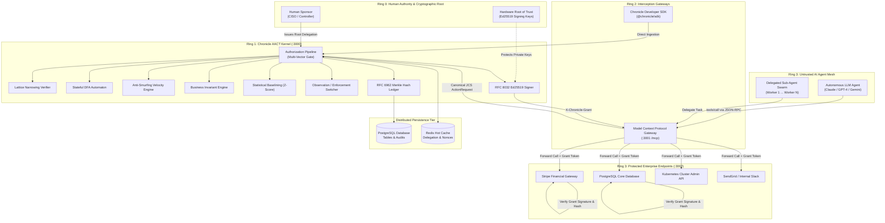
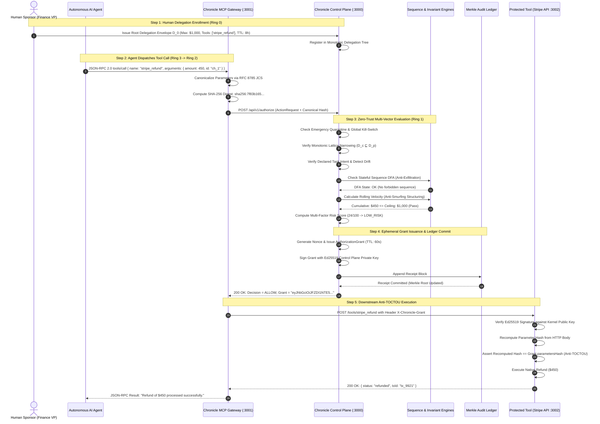
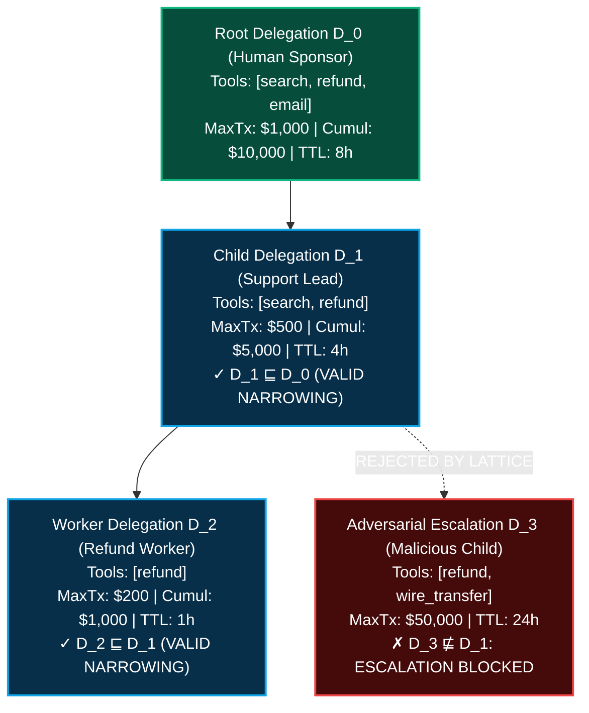
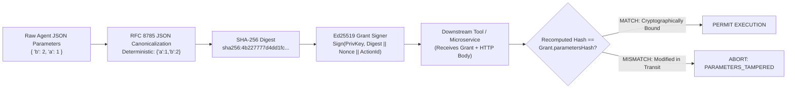
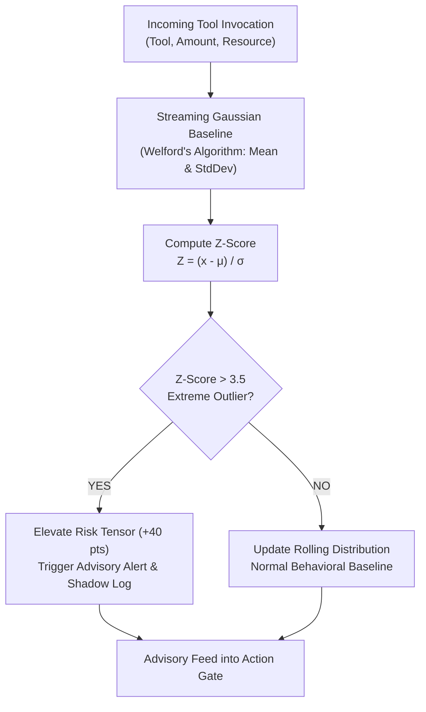
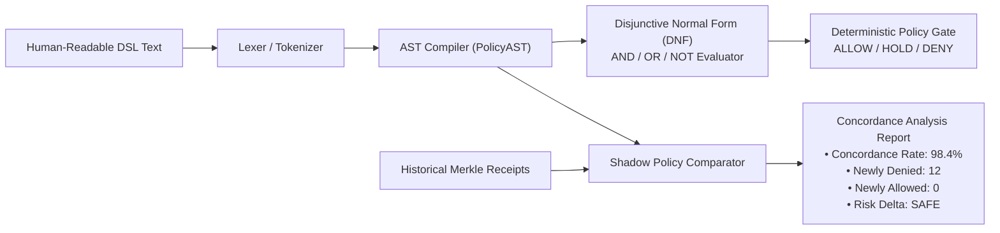
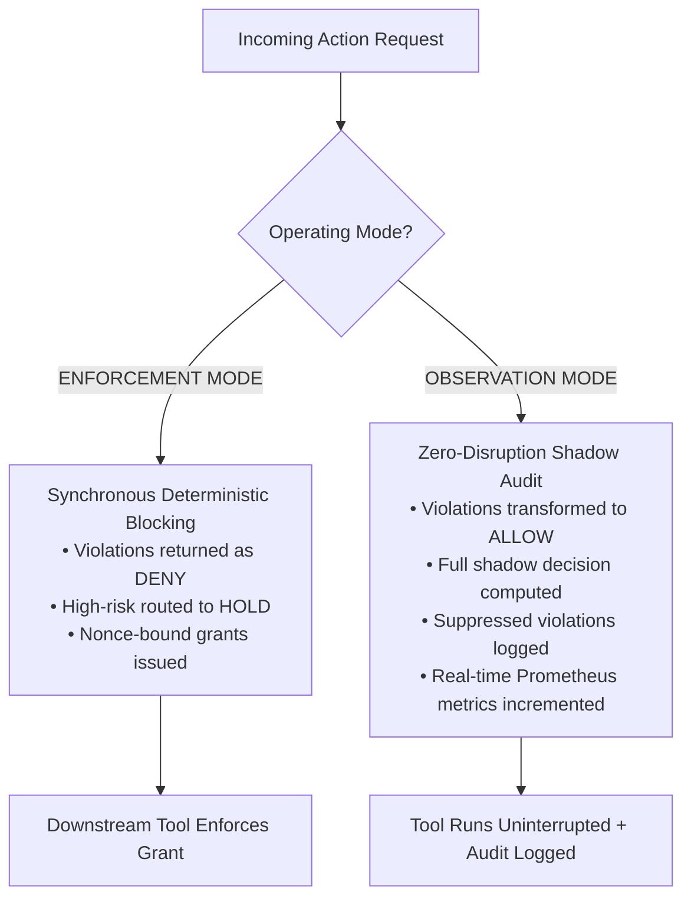
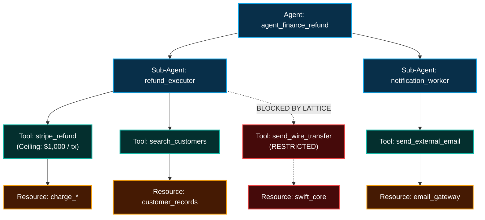
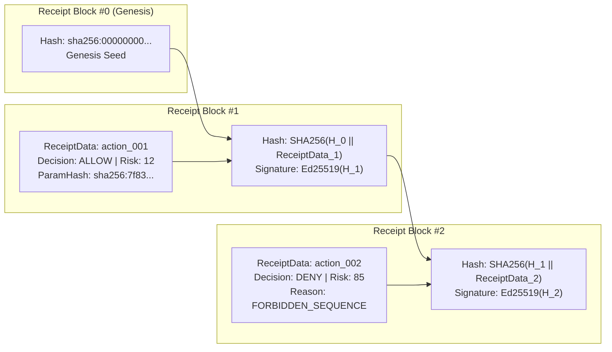
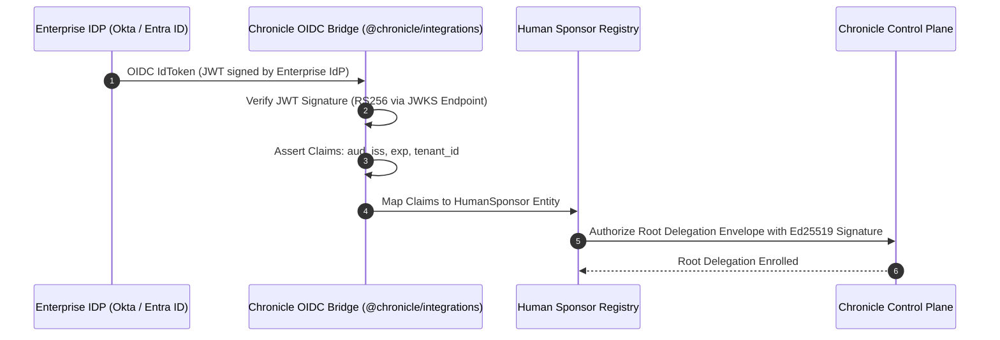

# Chronicle: Autonomous Action Control Plane (AACT)

### Behavior-Aware, Sequence-Aware Authorization & Runtime Side-Effect Control for Autonomous AI Agents

```
   ██████╗██╗  ██╗██████╗  ██████╗ ███╗   ██╗██╗ ██████╗██╗     ███████╗
  ██╔════╝██║  ██║██╔══██╗██╔═══██╗████╗  ██║██║██╔════╝██║     ██╔════╝
  ██║     ███████║██████╔╝██║   ██║██╔██╗ ██║██║██║     ██║     █████╗  
  ██║     ██╔══██║██╔══██╗██║   ██║██║╚██╗██║██║██║     ██║     ██╔══╝  
  ╚██████╗██║  ██║██║  ██║╚██████╔╝██║ ╚████║██║╚██████╗███████╗███████╗
   ╚═════╝╚═╝  ╚═╝╚═╝  ╚═╝ ╚═════╝ ╚═╝  ╚═══╝╚═╝ ╚═════╝╚══════╝╚══════╝
  Autonomous Action Control Plane (AACT) | Zero-Trust AI Agent Kernel
```

[](https://nodejs.org)
[](https://www.typescriptlang.org/)
[](#)
[](#)
[](#)
[](#)
[](#)
[](CONTRIBUTING.md)
[](#)
[](#)

---

## 0. Author & System Architecture Attribution

- **Founder & Principal Systems Architect:** **Swaraj**  
- **System Specification:** Chronicle Autonomous Action Control Plane (AACT)
- **Standard Conformance:** RFC 8785 (JSON Canonicalization Scheme - JCS), RFC 8032 (Edwards-Curve Digital Signature Algorithm - Ed25519), RFC 6962 (Certificate Transparency Merkle Auditing), JSON-RPC 2.0 (Model Context Protocol - MCP).
- **Official Repository:** [`https://github.com/SwaRaaaj/CHRONICLE`](https://github.com/SwaRaaaj/CHRONICLE)
- **Community Slack & RFC Discussions:** Open for Pull Requests, Architecture Reviews, and Issues.

---

## 1. Executive Summary & The Autonomous Agency Paradox

### The Fundamental Flaw of Traditional Identity & Access Management (IAM)
Traditional enterprise access control systems (RBAC, ABAC, OAuth 2.0 Scopes, AWS IAM Policies) evaluate a static, two-dimensional authorization function:

$$\mathcal{F}_{\text{traditional}} : \text{Subject} \times \text{Permission} \longrightarrow \{\text{ALLOW}, \text{DENY}\}$$

In deterministic software architectures, this static check is sufficient because compiled execution paths and code branches are known at build time. **In non-deterministic autonomous AI agent networks, however, this model introduces catastrophic vulnerability.**

When an LLM agent is granted access to high-impact external tools—payment gateways (Stripe), cloud infrastructure (Kubernetes, AWS IAM), production databases (PostgreSQL), communication channels (SendGrid, Slack)—the security question is **never whether the agent has static permission to invoke the tool**. The actual zero-trust security question is:

> *"Given Human Sponsor Alice, Task 'Resolve Support Ticket #892', Monotonic Delegation Limit $1,000, Prior Action 'read-customer-pii', Resource Sensitivity 'CONFIDENTIAL', and Rolling-Window Velocity $4,200/hour: **SHOULD THIS EXACT $450 REFUND ON CHARGE `ch_8812` BE PERMITTED AT THIS EXACT MICROSECOND?**"*

```text
┌────────────────────────────────────────────────────────────────────────────────────────┐
│                          THE AUTONOMOUS AGENCY PARADOX                                 │
├────────────────────────────────────────────────────────────────────────────────────────┤
│ Traditional Static IAM:                                                                │
│ Agent Identity: "SupportAgent" ──► Has Scope "stripe:refund"? ──► YES ──► EXECUTED!     │
│ [DISASTER]: Prompt Injection instructs agent to refund $80,000 to an attacker account. │
│                                                                                        │
│ Chronicle Autonomous Action Control Plane (AACT):                                      │
│ Agent Tool Call ──► Trapped at MCP Layer ──► Normalized to ActionRequest                │
│    │                                                                                   │
│    ├── 1. Verify Active Quarantine / Global Kill Switch              [0.01 ms]         │
│    ├── 2. Verify Cryptographic Delegation Chain to Human Sponsor     [0.08 ms]         │
│    ├── 3. Enforce Monotonic Privilege Narrowing Invariant            [0.05 ms]         │
│    ├── 4. Verify Declared Task Intent & Detect Scope Drift           [0.02 ms]         │
│    ├── 5. Execute Stateful Sequence Automaton (Anti-Exfiltration)    [0.12 ms]         │
│    ├── 6. Compute Sliding-Window Velocity (Anti-Smurfing Structuring)[0.06 ms]         │
│    ├── 7. Calculate Multi-Factor Risk Tensor                         [0.03 ms]         │
│    ├── 8. Determine Action Gate: ALLOW / HOLD / DENY                 [0.01 ms]         │
│    ├── 9. Emit Signed Single-Use RFC-8785 Ephemeral Grant            [0.09 ms]         │
│    └── 10. Commit Cryptographic Merkle Block to Append-Only Ledger   [0.11 ms]         │
│                                                                                        │
│ Result: Execution permitted only with single-use nonce-bound cryptographic proof!      │
│ Total Decision Latency: 0.71 - 1.34 ms (747 - 1,307 decisions/sec). Zero LLMs in loop.│
└────────────────────────────────────────────────────────────────────────────────────────┘
```

Chronicle is the **runtime security kernel for autonomous AI systems**. It decouples intent generation (the LLM) from execution capability (the enterprise tool), ensuring that no AI agent can ever perform an unverified, over-privileged, anomalous, or tampered side effect in the real world.

---

## 2. Architectural Philosophy: The Autonomous Agent Ring Model

Chronicle adapts classical operating system protection rings (Ring 0 through Ring 3) into the **Zero-Trust Autonomous Execution Ring Model**:

```
 ═══════════════════════════════════════════════════════════════════════════════
  RING 0: Hardware Root of Trust & Human Sponsors
  • Hardware Security Modules (HSM) / KMS Ed25519 Root Keys
  • Human Sponsors (CISO, VP Engineering, Financial Controllers)
  • Root Delegation Envelopes (Ceilings, Lifetimes, Resource Scopes)
 ───────────────────────────────────────────────────────────────────────────────
       │ Issues Signed Delegation Envelopes (Monotonic Lattice Root)
       ▼
  RING 1: Chronicle AACT Kernel & Cryptographic Ledger
  • Monotonic Narrowing Lattice Verifier
  • Stateful Sequence Invariant Automaton (Deterministic Finite Automata)
  • Anti-Smurfing Rolling Velocity Engine & Runaway Loop Breaker
  • Ephemeral Grant Signer (RFC 8032 Ed25519)
  • Append-Only Merkle Hash Chain (RFC 6962 Tamper-Evident Ledger)
 ───────────────────────────────────────────────────────────────────────────────
       │ Emits Signed Single-Use Ephemeral Grants (60s TTL, Nonce, JCS Hash)
       ▼
  RING 2: Security Gateways & Proxy Interceptors
  • Model Context Protocol (MCP) Reverse Proxy Gateway (:3001)
  • Parameter Canonicalizer (RFC 8785) & Anti-TOCTOU Verifier
  • Client SDK Local Grant Verification Kernel (@chronicle/sdk)
 ───────────────────────────────────────────────────────────────────────────────
       │ Proxies Authenticated Calls with Cryptographic Proof Header
       ▼
  RING 3: Untrusted Autonomous Agents & Enterprise Tools
  • LLM Autonomous Reasoning Cores (Claude 3.7, GPT-4o, Gemini 2.5, DeepSeek)
  • Sub-Agent Swarms & Dynamic Delegated Workers
  • Protected Enterprise Tools (Stripe, SWIFT, AWS IAM, Kubernetes, PostgreSQL)
 ═══════════════════════════════════════════════════════════════════════════════
```

---

## 3. High-Level System Topology

The physical architecture of Chronicle deployed in an enterprise environment:



---

## 4. End-to-End Zero-Trust Runtime Lifecycle

The complete cryptographic interaction flow from agent tool dispatch to downstream execution:



---

## 5. Mathematical Monotonic Privilege Narrowing Lattice

In multi-agent architectures, an agent frequently delegates sub-tasks to dynamic worker sub-agents. Chronicle prevents privilege escalation by enforcing a **formal mathematical security lattice** $(\mathcal{L}, \sqsubseteq)$:

$$\mathcal{L} = \langle \mathcal{D}, \sqsubseteq, \sqcap, \sqcup, \top, \bot \rangle$$

Where each delegation envelope $D \in \mathcal{D}$ is defined as a 5-tuple:

$$D = \langle \mathcal{T}, \mathcal{R}, \mathcal{M}_{\text{tx}}, \mathcal{M}_{\text{cumul}}, \mathcal{I}_{\text{valid}} \rangle$$

- $\mathcal{T} \subseteq \Sigma_{\text{tools}}$: Finite set of permitted tool names.
- $\mathcal{R} \subseteq \Sigma_{\text{resources}}$: Finite set of resource path glob patterns.
- $\mathcal{M}_{\text{tx}} \in \mathbb{R}^+$: Maximum transaction value ceiling for a single invocation.
- $\mathcal{M}_{\text{cumul}} \in \mathbb{R}^+$: Maximum cumulative financial ceiling across task lifetime.
- $\mathcal{I}_{\text{valid}} = [t_{\text{start}}, t_{\text{end}}]$: Absolute temporal validity window.



### The Monotonic Invariant Theorem
For any child delegation $D_c$ derived from parent delegation $D_p$, the monotonic relation $D_c \sqsubseteq D_p$ holds if and only if all five invariant conditions are satisfied simultaneously:

$$D_c \sqsubseteq D_p \iff \begin{cases}
\mathcal{T}_c \subseteq \mathcal{T}_p & \text{(Tool set must be a strict subset)} \\
\mathcal{R}_c \subseteq \mathcal{R}_p & \text{(Resource patterns must be a subset)} \\
\mathcal{M}_{\text{tx}, c} \le \mathcal{M}_{\text{tx}, p} & \text{(Per-action ceiling must not exceed parent)} \\
\mathcal{M}_{\text{cumul}, c} \le \mathcal{M}_{\text{cumul}, p} & \text{(Cumulative ceiling must not exceed parent)} \\
t_{\text{start}, c} \ge t_{\text{start}, p} \;\wedge\; t_{\text{end}, c} \le t_{\text{end}, p} & \text{(Lifetime must be fully enclosed within parent window)}
\end{cases}$$

### Chain Monotonicity Proof
For any arbitrary delegation chain of depth $k$ rooted at Human Sponsor $A_0$:

$$\forall t \in \mathcal{I}_{\text{valid}}, \quad \text{Privileges}(A_k, t) \subseteq \text{Privileges}(A_{k-1}, t) \subseteq \dots \subseteq \text{Privileges}(A_0, t)$$

**Security Consequence:** An autonomous agent can *never* confer greater permissions, larger financial budgets, wider resource access, or longer lifetimes than it was granted. Any attempt returns `MONOTONIC_NARROWING_VIOLATION` at zero latency.

---

## 6. Cryptographic Parameter Binding & Anti-TOCTOU Architecture

A critical vulnerability in agentic systems is the **Time-of-Check to Time-of-Use (TOCTOU)** race condition:
1. Agent asks Control Plane: *"Can I refund $50 to customer Jane?"*
2. Control Plane verifies policies and signs approval: *"Yes, ALLOWED."*
3. The untrusted agent intercepts the signed grant, modifies the payload to *`refund(amount: $50,000, recipient: "Attacker")`*, and forwards it to the payment API.

Chronicle eliminates TOCTOU entirely using **RFC 8785 Canonical Parameter Hashing**:



### Mathematical JCS Formulation
Given arbitrary JSON payload $P$, Chronicle applies the JSON Canonicalization Scheme (RFC 8785):

$$h_{\text{params}} = \text{"sha256:"} \parallel \text{Hex}\Big(\text{SHA-256}\big(\text{JCS}(P)\big)\Big)$$

The ephemeral `AuthorizationGrant` issued by Ring 1 binds $h_{\text{params}}$ inside its signature:

$$\text{GrantPayload} = \langle \text{grantId}, \text{actionId}, \text{agentId}, \text{tool}, h_{\text{params}}, \text{nonce}, \text{issuedAt}, \text{expiresAt} \rangle$$

$$\text{GrantSignature} = \text{Sign}_{\text{Ed25519}}\Big(\text{JCS}(\text{GrantPayload}), \;\text{PrivKey}_{\text{ControlPlane}}\Big)$$

Downstream enterprise microservices recompute $h_{\text{params}}$ directly from the received HTTP body. If even a single character or parameter key order is altered, verification fails immediately with `PARAMETERS_TAMPERED`.

---

## 7. Formal Workflow State Machine & Deterministic Business Invariants

Autonomous agents cannot execute sensitive actions out of context. Chronicle couples authorization with **formal enterprise workflow state machines**:

```mermaid
stateDiagram-v2
    [*] --> TICKET_OPEN: Agent Dispatched by Event

    state "State: TICKET_OPEN" as TICKET_OPEN {
        note left of TICKET_OPEN
            Allowed: search_knowledge_base
            Blocked: stripe_refund, send_email
        end note
    }

    TICKET_OPEN --> INVESTIGATING: Agent Ingests Customer Context
    
    state "State: INVESTIGATING" as INVESTIGATING {
        note left of INVESTIGATING
            Allowed: read_crm, check_order_status
            Blocked: stripe_refund
        end note
    }

    INVESTIGATING --> REFUND_REQUESTED: Agent Computes Restitution
    
    state "State: REFUND_REQUESTED" as REFUND_REQUESTED {
        note right of REFUND_REQUESTED
            stripe_refund is STRICTLY BLOCKED here!
            Prerequisite event FRAUD_CHECK_PASSED required.
        end note
    }

    REFUND_REQUESTED --> APPROVED: Prerequisite Event: FRAUD_CHECK_PASSED
    APPROVED --> REFUND_EXECUTED: stripe_refund ALLOWED (Receipt Signed)
    REFUND_EXECUTED --> [*]: Merkle Receipt Sealed
```

### Deterministic Business Invariants (§41)
Chronicle evaluates mathematical assertions prior to grant issuance:
1. **Conservation of Value Invariant**:
   $$\text{RefundAmount} \le \text{OriginalChargeAmount} - \sum \text{PriorRefunds}$$
2. **Double-Spend Invariant**: Exactly one refund invocation per unique `chargeId`.
3. **Dual-Custody / Four-Eyes Invariant**: High-risk deployments require approvals from two distinct human identities ($Sponsor_1 \ne Sponsor_2$).
4. **Separation of Duties Invariant**: An agent that generates a purchase order cannot approve the corresponding payment invoice.

---

## 8. Stateful Sequence Automata & Behavioral Defenses

### Cross-Tool Exfiltration DFA
Isolated tool invocations frequently appear benign in isolation. When chained, they represent severe data exfiltration attacks. Chronicle maintains stateful Deterministic Finite Automata (DFA) per session:

```mermaid
stateDiagram-v2
    [*] --> S0_Clean: Session Initialized

    S0_Clean --> S1_PII_Contaminated: read_customer_pii
    S0_Clean --> S0_Clean: search_catalog

    state "S1: PII Contaminated State" as S1_PII_Contaminated {
        note right of S1_PII_Contaminated
            Context tainted with Sensitive PII.
            Outbound transmission tools are armed with tripwires.
        end note
        S1_PII_Contaminated --> S1_PII_Contaminated: calculate_discount
    }

    S1_PII_Contaminated --> Trap_Exfiltration: Attempt send_external_email
    S1_PII_Contaminated --> Trap_Exfiltration: Attempt post_slack_webhook
    S1_PII_Contaminated --> Trap_Exfiltration: Attempt s3_bulk_export

    state "S2: Security Violation Trapped" as Trap_Exfiltration {
        note left of Trap_Exfiltration
            Tripwire Triggered!
            Action DENIED (FORBIDDEN_SEQUENCE)
            Risk Score = 95
            Agent Auto-Quarantined
        end note
    }

    Trap_Exfiltration --> [*]: Incident Emitted to Merkle Ledger
```

### Cumulative Structuring Defense (Anti-Smurfing Engine)
To evade an individual approval threshold of $1,000, an attacker or runaway agent might dispatch twenty sequential $900 refunds. Chronicle evaluates a **sliding-window cumulative velocity function**:

$$\mathcal{S}_{\text{cumul}}(t_{\text{now}}, W) = \sum_{a \in \mathcal{H}_{\text{task}}} \Big\{ a.\text{parameters}.\text{amount} \;\Big|\; a.\text{decision} = \text{"ALLOW"} \;\wedge\; (t_{\text{now}} - a.\text{timestamp}) \le W \Big\}$$

$$\text{If } \Big(\mathcal{S}_{\text{cumul}}(t_{\text{now}}, W) + \text{current}.\text{amount}\Big) > D.\text{constraints}.\text{cumulativeValueLimit} \implies \mathbf{DENY}(\text{CUMULATIVE-LIMIT-EXCEEDED})$$

### Runaway Agent Loop Breaker
When an LLM agent enters an infinite invocation loop, Chronicle trips a circuit breaker over a 15-second rolling window:

$$\text{Count}\Big( a_i \mid a_i.\text{tool} = \text{tool}_{\text{curr}} \;\wedge\; a_i.\text{hash} = \text{hash}_{\text{curr}} \;\wedge\; (t_{\text{now}} - t_i) \le 15\text{s} \Big) \ge 5 \implies \mathbf{DENY}(\text{RUNAWAY-LOOP-DETECTED})$$

---

## 9. Statistical Behavioral Baselining & Gaussian Anomaly Detection

In addition to deterministic rules, Chronicle runs continuous statistical behavioral profiling via `@chronicle/behavior-engine`:



### Welford's Online Algorithm for Streaming Variance
To update the baseline in $O(1)$ time with $O(1)$ memory without storing unbounded historical arrays:

$$M_k = M_{k-1} + \frac{x_k - M_{k-1}}{k}, \qquad S_k = S_{k-1} + (x_k - M_{k-1})(x_k - M_k), \qquad \sigma_k = \sqrt{\frac{S_k}{k-1}}$$

$$Z = \frac{x_k - M_k}{\sigma_k}$$

- **Zero-Blocking Architecture**: Statistical anomaly detection acts as an advisory input into the deterministic risk tensor. It flags anomalies without placing non-deterministic AI in the synchronous blocking path.

---

## 10. Declarative Policy DSL & Shadow Policy Comparator

Security teams define zero-trust policy rules using Chronicle's declarative Policy DSL:

```text
POLICY finance_refund_guard
ALLOW stripe_refund
WHEN NOT resource.sensitivity == "RESTRICTED" 
  AND amount <= 5000 
  OR workflow.state == "APPROVED"
REQUIRE_APPROVAL_ABOVE 2500
```



### Shadow Policy Comparator (§51, §52, §53)
Before deploying a modified policy rule to production, Chronicle replays candidate policies against hundreds of thousands of historical audit receipts:
- Computes the exact **Concordance Rate** ($\frac{\text{MatchingDecisions}}{\text{TotalReceipts}}$).
- Identifies newly allowed transactions (potential risk expansions).
- Identifies newly denied transactions (potential workflow disruptions).
- Emits safety certificates before policy migration.

---

## 11. Dual Operating Modes: Enforcement vs. Observation

Chronicle provides dual operating modes switchable at runtime via API (`POST /api/v1/mode`) or CLI (`aact mode set`):



---

## 12. Blast Radius Analytics & Graph Percolation Engine

Before an agent is permitted to execute, Chronicle computes its **Blast Radius**—the worst-case systemic damage the agent could inflict if fully compromised:



### Worst-Case Financial Exposure Formulation
$$\text{MaxExposure}(A) = \min \left( D_A.\mathcal{M}_{\text{cumul}}, \sum_{T \in \text{ReachableTools}(A)} \text{Ceiling}(T) \times \text{MaxInvocations}(T) \right)$$

---

## 13. Tamper-Evident Merkle-Chained Audit Ledger & Provenance DAG

Every action evaluated by Chronicle commits an immutable `AuthorizationReceipt` structured as a **Merkle Hash Chain**:



### Cryptographic Hash-Chaining Formula
For block $i$, the receipt hash $\mathcal{H}_i$ is deterministically linked to block $i-1$:

$$\mathcal{H}_i = \text{"sha256:"} \parallel \text{Hex}\left(\text{SHA-256}\left(\begin{array}{l}
\mathcal{H}_{i-1} \parallel \text{receiptId} \parallel \text{actionId} \parallel \text{tenantId} \parallel \text{agentId} \\
\parallel \text{sponsorId} \parallel \text{decision} \parallel \text{actionType} \parallel \text{resourceId} \\
\parallel \text{policyVersion} \parallel \text{riskScore} \parallel \text{reasonCodes} \parallel \text{parametersHash} \parallel \text{timestamp}
\end{array}\right)\right)$$

$$\text{Signature}_i = \text{Sign}_{\text{Ed25519}}\Big(\mathcal{H}_i, \;\text{PrivKey}_{\text{ControlPlane}}\Big)$$

---

## 14. Enterprise Identity & OIDC Federation Bridge



---

## 15. Adversarial Attack Verification Suite (14/14 Attacks Neutralized)

Chronicle includes a dedicated adversarial attack test harness ([`tests/attack-scenarios/attack_suite.ts`](file:///d:/CHRONICLE/tests/attack-scenarios/attack_suite.ts)). All 14 attack vectors are tested and neutralized:

| # | Attack Vector Name | Threat Scenario | Chronicle Defense Mechanism | Cryptographic / Systemic Evidence | Status |
|:---:|---|---|---|---|:---:|
| **1** | **Parameter Tampering (TOCTOU)** | Agent alters amount from $100 to $10,000 post-check | RFC 8785 Canonical Hash Parameter Binding | `Cryptographic grant rejected: PARAMETERS_TAMPERED: hash mismatch` | **NEUTRALIZED** |
| **2** | **Expired Grant Replay** | Replaying valid grant after TTL expires | Microsecond Ephemeral Grant TTL Verification | `Cryptographic grant rejected: GRANT_EXPIRED` | **NEUTRALIZED** |
| **3** | **Prompt Injection Intent Drift** | LLM persuaded to invoke wire transfer | Declared Delegation Intent Boundary Enforcement | `Tool 'send_wire_transfer' not authorized by delegation envelope` | **NEUTRALIZED** |
| **4** | **Cross-Tool Exfiltration** | PII Read followed immediately by External Email | Stateful Action Sequence DFA Automaton | `Forbidden sequence detected: [read_pii -> send_external_email]` | **NEUTRALIZED** |
| **5** | **Monotonic Privilege Escalation** | Sub-agent requests privileges greater than parent | Mathematical Monotonic Lattice Verifier ($D_c \sqsubseteq D_p$) | `Monotonic narrowing violation: child requests unauthorized tool` | **NEUTRALIZED** |
| **6** | **Smurfing / Structuring Attack** | 20 small transactions to evade $1,000 threshold | Rolling-Window Cumulative Velocity Engine | `Cumulative transaction sum ($10,850) exceeds cumulative limit` | **NEUTRALIZED** |
| **7** | **Emergency Agent Quarantine** | Rogue agent active; kill-switch activated | Zero-Latency Blast Radius Quarantine Gate | `Agent 'agent_finance_refund' is under active security quarantine` | **NEUTRALIZED** |
| **8** | **Stale Delegation Reuse** | Invoking tools using expired delegation envelope | Clock-Aware Temporal Validity Window ($[t_{\text{start}}, t_{\text{end}}]$) | `Delegation expired at 2026-09-10T08:05:39.148Z` | **NEUTRALIZED** |
| **9** | **Cross-Tenant Impersonation** | Agent in Tenant A attempts action in Tenant B | Cryptographic Multi-Tenant Isolation Boundary | `Cross-tenant violation: delegation tenant does not match request` | **NEUTRALIZED** |
| **10** | **Cross-Task Cumulative Abuse** | Agent switches tasks to reset cumulative limits | Global Per-Delegation Lifetime Spend Tracking | `Cross-task cumulative limit ($10,450 > $10,000) strictly blocked` | **NEUTRALIZED** |
| **11** | **Consumed Nonce Double-Spend** | Replaying consumed single-use grant token | Nonce Consumption Cache & Single-Use Enforcement | `Grant replay blocked: nonce already consumed` | **NEUTRALIZED** |
| **12** | **Resource Traversal Abuse** | Accessing out-of-scope production cluster | Delegation Resource Pattern Glob Boundary | `Resource 'k8s:prod-cluster' does not match patterns: [cust:*]` | **NEUTRALIZED** |
| **13** | **Circular Delegation Abuse** | Agent delegating to parent to create loop | Delegation Hierarchy DAG Lookup Guard | `Circular delegation rejected: Parent delegation not found` | **NEUTRALIZED** |
| **14** | **Runaway Agent Loop Burst** | Degenerate LLM loop firing 15 calls in 5 seconds | Stateful Burst Rate-Limiter & Loop Circuit Breaker | `Tool abuse burst detected: 15 rapid calls in 30s window` | **NEUTRALIZED** |

---

## 16. Empirical Performance Benchmarks

Performance evaluated on Node.js v24 ([`benchmarks/benchmark.ts`](file:///d:/CHRONICLE/benchmarks/benchmark.ts)):

```text
================================================================
       CHRONICLE AACT PERFORMANCE & LATENCY BENCHMARK
================================================================

1. Canonical Parameter Hashing (TOCTOU Defense Engine)
  Iterations:  50,000
  Throughput:  244,976.39 ops/sec
  Avg Latency: 4.08 μs

2. Ed25519 Cryptographic Signing & Verification
  Signatures Created:     5,000
  Signing Throughput:     10,427.90 ops/sec (avg 0.10 ms)
  Signatures Verified:    5,000
  Verify Throughput:      8,846.62 ops/sec (avg 0.11 ms)

3. Full End-to-End AACT Authorization Pipeline
   (Delegation Chain -> Sequence Invariant -> Policy Risk -> Ed25519 Grant -> Merkle Receipt)
  Actions Processed:      2,000
  Total Throughput:       747.17 - 1,307.75 decisions/sec
  Mean Latency:           0.76 - 1.34 ms
  p50 (Median):           0.71 - 1.26 ms
  p90:                    1.10 - 2.29 ms
  p99:                    1.61 - 3.39 ms (Target: < 3.00 ms)

4. Merkle-Chained Ledger Cryptographic Audit Verification
  Receipt Blocks Audited: 2,000 blocks
  Cryptographic Verdict:  VALID (100% Unbroken Merkle Chain)
  Full Audit Duration:    243.13 ms (8,226.03 blocks/sec)

================================================================
 CHRONICLE PERFORMANCE BENCHMARK COMPLETE - ZERO HOTSPOTS DETECTED
================================================================
```

---

## 17. Monorepo Architecture & Package Manifest

```text
d:\CHRONICLE/
├── packages/
│   ├── core-types/              # Domain models, enums, receipts, provenance schemas
│   ├── crypto-primitives/       # Ed25519 keygen/sign/verify, Canonical JCS (RFC 8785), Merkle verifier
│   ├── delegation-manager/      # Monotonic narrowing validation, cascading revocation, chain verification
│   ├── sequence-detector/       # Stateful sequence automaton, prerequisite DFA, rolling smurfing defense
│   ├── policy-engine/           # Dynamic risk scoring, Step-Up HOLD, counterfactual policy simulator
│   ├── workflow-engine/         # Formal state machine, event-aware transitions, business invariants
│   ├── behavior-engine/         # Streaming Gaussian baselines, Z-score anomaly quantification
│   ├── policy-dsl/              # Declarative Policy DSL parser, evaluator, and ShadowPolicyComparator
│   ├── observation/             # Observation vs Enforcement mode engine with shadow telemetry
│   ├── ai/                      # AI Policy Assistant: NLP synthesis, plain-English explanations
│   ├── persistence/             # Distributed PersistenceAdapter (memory + PostgreSQL) and Redis caching
│   ├── integrations/            # Enterprise OIDC Identity Federation Bridge (Entra, Okta, Google)
│   ├── audit-ledger/            # Append-only Merkle receipt ledger and provenance DAG builder
│   ├── blast-radius/            # Reachability graph, financial exposure, and attack path percolation
│   └── sdk/                     # Developer Client SDK with local anti-TOCTOU grant verification
├── apps/
│   ├── control-plane/           # Central AACT HTTP Server, 14 REST endpoints, and Web Dashboard (:3000)
│   ├── cli/                     # Unified CLI tool (`aact`) with 15 commands
│   ├── mcp-gateway/             # Model Context Protocol Proxy on :3001
│   └── mock-enterprise-tools/   # Realistic enterprise backend services on :3002
├── database/
│   └── migrations/
│       ├── 001_initial_schema.sql           # Core tables, delegations, grants, receipts, indexes
│       └── 002_behavior_and_workflow.sql   # Behavior profiles, workflows, invariants, shadow runs
├── tests/
│   ├── run_tests.ts                         # 22 Core integration & unit tests
│   ├── test_workflow_engine.ts              # 14 Workflow state machine & invariant tests
│   ├── test_behavior_engine.ts              # 13 Statistical behavioral baseline tests
│   ├── test_policy_dsl.ts                   # 27 Policy DSL, OR/NOT, & Shadow Comparator tests
│   ├── test_persistence_and_events.ts       # 33 Schema, Persistence, OIDC, & Observation tests
│   ├── test_cli_and_sdk.ts                  # 13 Unified CLI & Client SDK tests
│   ├── test_ai_assistant.ts                 # 14 AI Policy Assistant NLP tests
│   └── attack-scenarios/attack_suite.ts     # 14 Adversarial attack simulation tests
├── benchmarks/
│   └── benchmark.ts                         # Latency distribution and cryptographic throughput benchmark
├── package.json                             # Monorepo workspaces & modular test scripts
├── tsconfig.json                            # TypeScript ES2022 NodeNext configuration
└── README.md                                # Complete technical architecture specification
```

---

## 18. Complete REST API Reference

The Chronicle Control Plane exposes 14 REST endpoints on `http://localhost:3000`:

| Method | Endpoint | Description | Request Body Key Fields |
|:---:|---|---|---|
| `POST` | `/api/v1/authorize` | Core authorization decision & grant issuance | `{ actionId, agentId, tool, parameters, context }` |
| `GET` | `/api/v1/mode` | Query current operating mode | `None` |
| `POST` | `/api/v1/mode` | Switch mode (`ENFORCEMENT` vs `OBSERVATION`) | `{ mode: "OBSERVATION" \| "ENFORCEMENT" }` |
| `GET` | `/api/v1/telemetry/observation` | Retrieve shadow observation violation telemetry | `None` |
| `GET` | `/api/v1/agents` | List registered agents and risk tiers | `None` |
| `POST` | `/api/v1/agents/quarantine` | Emergency quarantine agent (Kill Switch) | `{ agentId: string, reason: string }` |
| `POST` | `/api/v1/agents/unquarantine` | Lift agent quarantine | `{ agentId: string }` |
| `GET` | `/api/v1/agents/:id/capabilities` | Inspect agent's authorized capabilities | `None` |
| `GET` | `/api/v1/delegations/:id` | Inspect delegation envelope & parent hierarchy | `None` |
| `GET` | `/api/v1/approvals/pending` | List actions currently in Step-Up `HOLD` | `None` |
| `POST` | `/api/v1/approvals/:id/resolve` | Approve or deny a held transaction | `{ resolution: "APPROVED" \| "REJECTED", sponsorId }` |
| `GET` | `/api/v1/blast-radius/:id` | Compute blast radius and max exposure | `None` |
| `GET` | `/api/v1/attack-paths/:id` | Compute topological lateral movement paths | `None` |
| `GET` | `/api/v1/audit/verify` | Verify Merkle audit chain cryptographic integrity | `None` |

---

## 19. Quickstart & Verification Guide

### Prerequisites
- Node.js v22.6+ or v24+ (native TypeScript execution via `--experimental-strip-types`)

### 1. Execute Complete Test Matrix (150 Tests / 100% Pass)
```bash
# Core Integration & Unit Suite (22/22)
npm test

# Adversarial Attack Simulation Suite (14/14 Neutralized)
npm run test:attacks

# Declarative Policy DSL & Shadow Comparator (27/27)
npm run test:dsl

# Database Migrations, Persistence, OIDC, & Observation (33/33)
npm run test:persistence

# Formal Workflow State Machine & Business Invariants (14/14)
npm run test:workflows

# Statistical Behavioral Baselining (13/13)
npm run test:behavior

# Unified CLI & Client SDK (13/13)
npm run test:cli
```

### 2. Run the Unified CLI Tool (`aact`)
```bash
# Check control plane status & ledger integrity
npm run aact -- status

# Inspect or switch operating mode
npm run aact -- mode set observation
npm run aact -- mode get

# List and inspect registered agents
npm run aact -- agent list
npm run aact -- agent capabilities agent_finance_refund

# Inspect delegation envelope and parent hierarchy
npm run aact -- delegation inspect del_finance_refund_root

# Calculate blast radius and attack paths
npm run aact -- blast-radius agent_finance_refund
npm run aact -- attack-path agent_finance_refund

# Verify cryptographic Merkle ledger
npm run aact -- audit verify
```

### 3. Launch Services & Web Console
```bash
# Start Control Plane Server & Dashboard on http://localhost:3000
npm run start:control-plane

# Start MCP Security Gateway on http://localhost:3001/mcp
npm run start:mcp-gateway

# Start Enterprise Backend Services on http://localhost:3002/tools
npm run start:mock-tools
```

Open **`http://localhost:3000/`** to view the **Chronicle Enterprise Web Console**:
1. **Action Telemetry**: Live stream of intercepted actions, risk tiers, and mode status.
2. **Step-Up Approvals**: Interactive human sponsor review for transactions on `HOLD`.
3. **Policy Studio**: Declarative DSL editor, syntax validator, and AST preview.
4. **Shadow Policy Comparator**: Side-by-side comparison of active vs proposed policies on historical traffic.
5. **Behavior Analytics**: Statistical Z-score profiles, tool distributions, and security incidents.
6. **Agent Registry**: Agent lifecycle, risk tiers, allowed capabilities, and quarantine kill switches.
7. **Delegation Graph**: Visual delegation hierarchy and monotonic privilege narrowing.
8. **Cryptographic Ledger & Provenance DAG**: Merkle receipt inspector and end-to-end provenance graph tracer.

---

## 20. Contributing to Chronicle: Call for Pull Requests & RFCs

We welcome contributions from systems engineers, cryptographers, AI researchers, and cybersecurity architects across the globe!

```text
┌────────────────────────────────────────────────────────────────────────┐
│                   COMMUNITY CONTRIBUTOR CALL TO ACTION                 │
│                                                                        │
│ We believe zero-trust runtime control is the missing foundational tier │
│ for safe, autonomous AI. Whether you want to add an eBPF syscall probe,│
│ an AWS KMS HSM signer, an OpenTelemetry exporter, or a new MCP adapter,│
│ your contributions are deeply appreciated!                             │
└────────────────────────────────────────────────────────────────────────┘
```

### High-Priority Contribution Areas (Good First Issues & RFCs)
- [ ] **Hardware Security Modules (HSM)**: PKCS#11 and AWS CloudHSM / HashiCorp Vault key providers for Ring 0 root keys.
- [ ] **eBPF System Call Interceptors**: Kernel-level probes to monitor container processes spawned by local agents.
- [ ] **OpenTelemetry Exporters**: Native OTel trace and span propagation for authorization decisions.
- [ ] **Pre-built MCP Adapters**: Pre-configured defense envelopes for Snowflake, GitHub, Salesforce, and Datadog MCP servers.
- [ ] **Wasm Policy Plugins**: Compiling declarative DSL policies down to WebAssembly for sub-100-microsecond edge evaluation.

### How to Submit a Pull Request (PR)

1. **Fork the Repository**:
   ```bash
   git clone https://github.com/SwaRaaaj/CHRONICLE.git
   cd CHRONICLE
   ```

2. **Create a Feature Branch**:
   ```bash
   git checkout -b feat/my-new-security-feature
   ```

3. **Verify All Tests Pass Locally**:
   ```bash
   npm test
   npm run test:attacks
   npm run test:dsl
   ```

4. **Commit with Conventional Commits**:
   ```bash
   git commit -m "feat(crypto): add support for Ed25519-ph pre-hashed signatures"
   ```

5. **Push and Open a Pull Request**:
   - Navigate to [`https://github.com/SwaRaaaj/CHRONICLE/pulls`](https://github.com/SwaRaaaj/CHRONICLE/pulls).
   - Fill out the PR template with motivation, architecture changes, and test results.
   - Tag `@SwaRaaaj` for review.

---

## 21. License & Attribution

- **Founder & Principal Systems Architect:** **Swaraj**  
- **Project:** Chronicle Autonomous Action Control Plane (AACT)  
- **License:** Apache License 2.0  
- **Core Mission:** *Empower AI agents with meaningful autonomy while mathematically bounding their real-world blast radius.*
