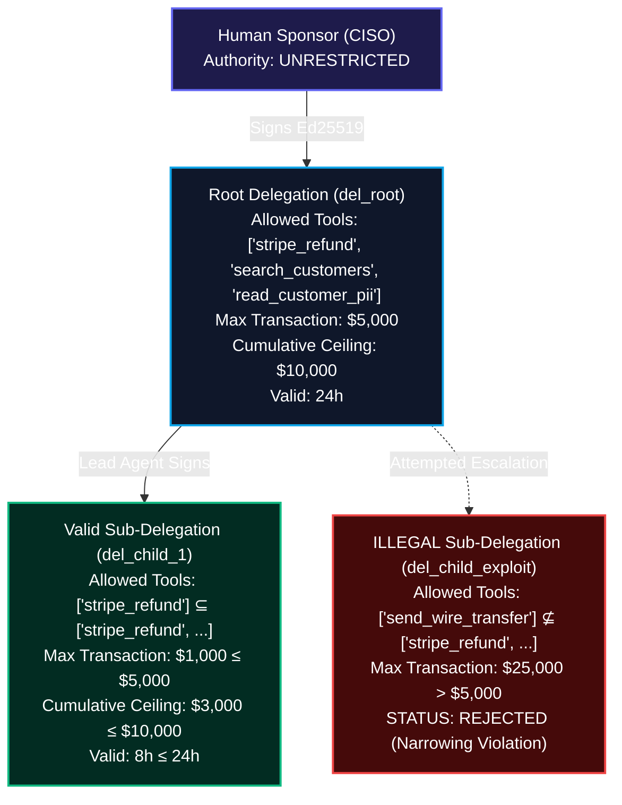
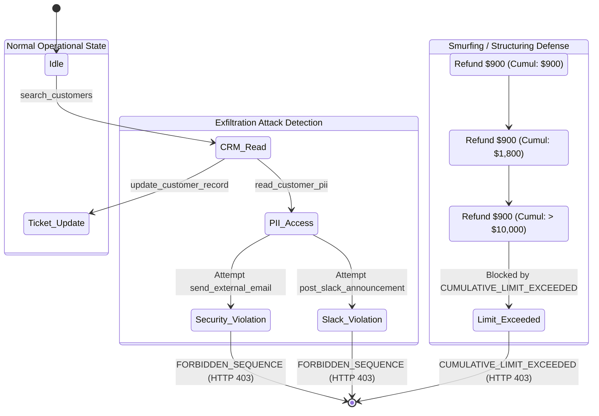
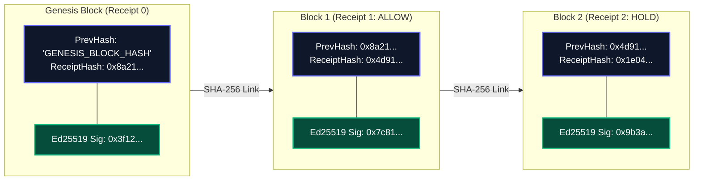
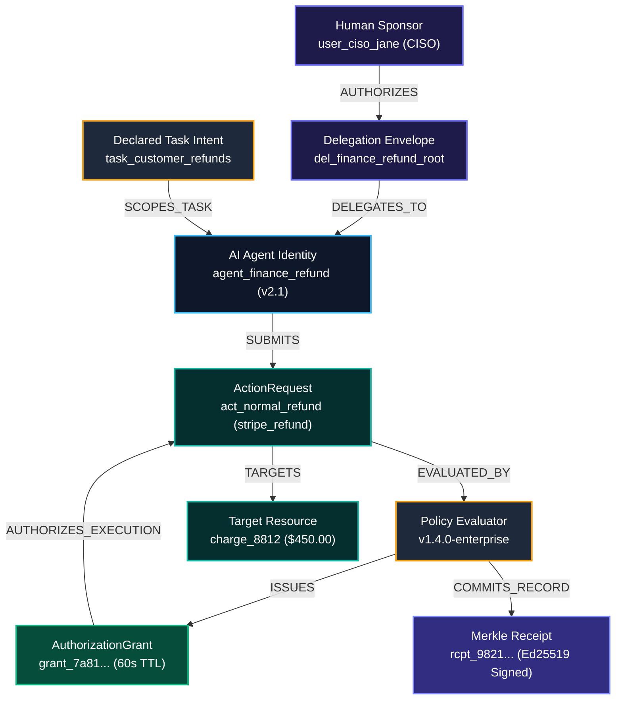

# Chronicle: Autonomous Action Control Plane (AACT)

### Behavior-Aware, Sequence-Aware Authorization & Runtime Side-Effect Control for AI Agents

**Author:** **Swaraj**  
**Architecture:** Zero-Trust Autonomous Action Control Plane (AACT)  
**Target Platform:** High-Throughput Distributed AI Systems, MCP Tool Interceptors & Enterprise Action Boundaries  
**Performance Tier:** Sub-Millisecond Decision Pipeline (< 0.8ms Mean, < 1.6ms p99, 1,300+ decisions/sec)  
**Cryptographic Primitives:** Ed25519 (RFC 8032), SHA-256 Canonical JSON Parameter Hashing (RFC 8785), Merkle Hash-Chaining  

---

## 1. Executive Summary & Core Engineering Thesis

Traditional Identity and Access Management (IAM) answers a static, coarse-grained question:
$$\text{Principal} \times \text{Permission} \longrightarrow \{\text{ALLOW}, \text{DENY}\}$$

In autonomous agentic architectures, static authorization catastrophically fails. An AI agent granted access to a refund tool or database API possesses the theoretical capability to execute an operation; however, whether a **specific transaction** should be executed at a **specific millisecond** depends on dimensions that traditional IAM cannot express:

$$\text{Decision} = \mathcal{F}\Big(\text{Identity}, \text{DelegationChain}, \text{DeclaredTaskIntent}, \text{ActionPayload}, \text{ResourceSensitivity}, \text{ActionHistory}, \text{WorkflowState}, \text{DynamicRisk}\Big)$$

```
                                    THE AUTHORIZATION SHIFT
  TRADITIONAL IAM:
  [ Identity ] ──────────────────────────► [ Static Role ] ─────────────────────────► [ ALLOW / DENY ]

  CHRONICLE AACT:
  ┌───────────────┐   ┌─────────────────┐   ┌─────────────────┐   ┌─────────────────┐
  │ Human Sponsor │──►│ Explicit Intent │──►│ Narrowed Chain  │──►│ Normalized Call │
  └───────────────┘   └─────────────────┘   └─────────────────┘   └────────┬────────┘
                                                                           │
  ┌────────────────────────────────────────────────────────────────────────▼────────────────────────┐
  │                           CHRONICLE RUNTIME CONTROL PLANE BOUNDARY                              │
  │  Identity ──► Monotonic Narrowing ──► Invariant Sequences ──► Risk Scoring ──► Merkle Ledger   │
  └────────────────────────────────────────┬────────────────────────────────────────────────────────┘
                                           │
                        ┌──────────────────┴──────────────────┐
                        ▼                                     ▼
             [ Cryptographic Grant ]                 [ Step-Up HOLD Queue ]
                        │                                     │
                        ▼                                     ▼
           [ Downstream Tool Execution ]               [ Human Sign-Off ]
```

Chronicle intercepts agent tool calls **immediately before privileged side effects occur**, evaluates multi-agent delegations, enforces mathematical monotonic privilege narrowing, detects multi-step exfiltration sequences, binds parameters to cryptographic grants to eliminate Time-of-Check to Time-of-Use (TOCTOU) exploits, and commits all decisions to a tamper-evident Merkle-chained ledger.

---

## 2. Complete End-to-End System Architecture ("The God Diagram")

The diagram below represents the complete data-flow and trust boundary architecture across Human Sponsors, Autonomous Agents, the MCP Security Gateway, the Chronicle Control Plane Core, and downstream Enterprise Backends:

```mermaid
flowchart TD
    classDef human fill:#1e1e38,stroke:#6366f1,stroke-width:2px,color:#fff;
    classDef agent fill:#111c2e,stroke:#38bdf8,stroke-width:2px,color:#fff;
    classDef gateway fill:#132338,stroke:#0ea5e9,stroke-width:2px,color:#fff;
    classDef controlplane fill:#0f172a,stroke:#6366f1,stroke-width:3px,color:#fff;
    classDef crypto fill:#092e20,stroke:#10b981,stroke-width:2px,color:#fff;
    classDef enterprise fill:#2a1215,stroke:#ef4444,stroke-width:2px,color:#fff;
    classDef ledger fill:#281e09,stroke:#f59e0b,stroke-width:2px,color:#fff;

    subgraph GovernanceLayer ["1. Human Sponsorship & Authority Boundary"]
        HS["Human Sponsor<br/>(e.g., CISO / Finance Lead)"]:::human
        DE_ROOT["Root Delegation Envelope<br/>(Ed25519 Signed | Scope & Budget Constrained)"]:::human
        HS -->|Issues & Signs| DE_ROOT
    end

    subgraph AgentExecutionLayer ["2. Autonomous Agent Execution Mesh"]
        AG_PRIMARY["Lead Autonomous Agent<br/>(e.g., Claude 3.5 Sonnet)"]:::agent
        DE_SUB["Child Delegation Envelope<br/>(Monotonically Narrowed: Cap_child ⊆ Cap_parent)"]:::agent
        AG_SUB["Sub-Agent / Tool Caller<br/>(e.g., GPT-4o Task Agent)"]:::agent

        DE_ROOT -->|Grants Constrained Authority| AG_PRIMARY
        AG_PRIMARY -->|Sub-Delegates with Narrowing| DE_SUB
        DE_SUB -->|Constrains Scope| AG_SUB
    end

    subgraph InterceptionLayer ["3. Protocol Interception Boundary"]
        MCP_REQ["Agent Tool Call<br/>(JSON-RPC 2.0 / MCP 'tools/call')"]:::gateway
        GW["Chronicle MCP Security Gateway<br/>(Reverse Proxy & Action Normalizer)"]:::gateway
        ACT_REQ["Canonical ActionRequest<br/>(Normalized Schema + SHA-256 Params Hash)"]:::gateway

        AG_SUB -->|Invokes Tool| MCP_REQ
        MCP_REQ --> GW
        GW -->|Generates Canonical Payload| ACT_REQ
    end

    subgraph ControlPlaneCore ["4. Chronicle Autonomous Action Control Plane (AACT Engine)"]
        direction TB
        subgraph Pipeline ["AACT Authorization Pipeline (< 1ms)"]
            P1["1. Kill-Switch & Active Quarantine Check<br/>(Master Lockdown & Per-Agent Quarantine)"]:::controlplane
            P2["2. Delegation Chain & Monotonic Narrowing Verifier<br/>(Recursive Parent Traverse & Cryptographic Signatures)"]:::controlplane
            P3["3. Intent Drift & Task Boundary Check<br/>(Declared TaskIntent vs Requested Tool/Resource)"]:::controlplane
            P4["4. Stateful Sequence & Invariant Engine<br/>(Forbidden Sequences, Prerequisites, Runaway Loops)"]:::controlplane
            P5["5. Cumulative Velocity & Smurfing Defense<br/>(Rolling Window Summation vs Financial Limits)"]:::controlplane
            P6["6. Dynamic Multi-Factor Risk Scorer<br/>(Resource Sensitivity + Monetary Class + Anomaly Score)"]:::controlplane
            P7{"Policy Gate Evaluator"}:::controlplane

            P1 --> P2 --> P3 --> P4 --> P5 --> P6 --> P7
        end
    end

    ACT_REQ --> P1

    subgraph DecisionOutputs ["5. Decision Routing & Cryptographic Artifacts"]
        DEC_DENY["DENY<br/>(Structured ReasonCode + Rejection Explanation)"]:::enterprise
        DEC_HOLD["HOLD / ESCALATE<br/>(Human Step-Up Queue + Scoped Token)"]:::ledger
        DEC_ALLOW["ALLOW<br/>(Issue Ephemeral Signed Grant)"]:::crypto

        P7 -->|Policy Violation / Anomaly| DEC_DENY
        P7 -->|Value > Approval Threshold| DEC_HOLD
        P7 -->|All Invariants Verified| DEC_ALLOW

        GRANT["AuthorizationGrant<br/>(Signed Ed25519 | Params Hash Bound | Nonce | 60s TTL)"]:::crypto
        DEC_ALLOW -->|Generates| GRANT

        APPROVAL_PORTAL["Step-Up Approval Portal<br/>(Human Sponsor Reviews Evidence & Decides)"]:::ledger
        DEC_HOLD --> APPROVAL_PORTAL
        APPROVAL_PORTAL -->|Human Approves| GRANT
    end

    subgraph AuditLedgerLayer ["6. Cryptographic Ledger & Audit Boundary"]
        RECEIPT["AuthorizationReceipt<br/>(Merkle Linked Hash | Ed25519 Signed)"]:::ledger
        LEDGER_CHAIN[("Append-Only Merkle Ledger<br/>Hash_i = SHA256(Hash_prev | Receipt_i)")]:::ledger
        PROVENANCE["Cryptographic Provenance DAG<br/>(Human ➔ Del ➔ Task ➔ Agent ➔ Policy ➔ Grant)"]:::ledger

        P7 -.->|Every Decision Recorded| RECEIPT
        RECEIPT --> LEDGER_CHAIN
        LEDGER_CHAIN --> PROVENANCE
    end

    subgraph BackendEnforcementLayer ["7. Enterprise Tool Execution"]
        TARGET_TOOL["Downstream Enterprise System<br/>(Stripe / SWIFT / Salesforce / K8s / Cloud IAM)"]:::enterprise
        VERIFIER["Chronicle Grant Verifier (SDK / Middleware)<br/>1. Verifies Control Plane Ed25519 Signature<br/>2. Verifies TTL (now ≤ expiresAt)<br/>3. Verifies SHA256(Payload) === grant.parametersHash"]:::crypto
        EXECUTE["Privileged Side-Effect Executed"]:::enterprise

        GRANT -->|Forwarded with 'X-Chronicle-Grant'| VERIFIER
        GW -->|Proxies Payload| VERIFIER
        VERIFIER -->|Integrity & Grant Valid| TARGET_TOOL
        TARGET_TOOL --> EXECUTE
        EXECUTE -->|Return Result| GW
        GW -->|Tool Output| AG_SUB
    end
```



---

## 3. Cryptographic Primitives & Anti-TOCTOU Architecture

### The Time-of-Check to Time-of-Use (TOCTOU) Threat in AI Agents
A critical vulnerability in autonomous systems is **Parameter Tampering**:
1. An agent requests authorization for a harmless action: `stripe_refund(chargeId="ch_1", amount=50)`.
2. The control plane authorizes the transaction based on the $50 amount.
3. The rogue agent (or a compromised intermediate execution proxy) mutates the outgoing payload to `amount=50000` before dispatching to Stripe.

```mermaid
sequenceDiagram
    autonumber
    actor Agent as Autonomous Agent
    participant CP as Chronicle Control Plane
    participant Tool as Enterprise Payment Tool (Stripe)

    Note over Agent,CP: PHASE 1: Canonical Parameter Binding
    Agent->>CP: ActionRequest { tool: "stripe_refund", params: { amount: 50, chargeId: "ch_99" } }
    CP->>CP: Compute Canonical SHA-256 Hash:<br/>canonicalHash(params) = "sha256:7f9a8..."
    CP->>CP: Evaluate Invariants, Delegations & Risk (0.7ms)
    CP->>CP: Sign Ephemeral Grant via Ed25519 Private Key:<br/>Sign("grant_id|action_id|tool|sha256:7f9a8...|nonce|ttl")
    CP-->>Agent: Returns Signed AuthorizationGrant

    Note over Agent,Tool: PHASE 2: Downstream Verification & Anti-TOCTOU Defense
    rect rgb(30, 20, 20)
    Note over Agent: ATTACK: Agent modifies amount from $50 to $50,000
    Agent->>Tool: Execute stripe_refund({ amount: 50000, chargeId: "ch_99" }) + AuthorizationGrant
    end

    Tool->>Tool: Step A: Check Grant Expiration (now < expiresAt)
    Tool->>Tool: Step B: Verify Control Plane Ed25519 Signature
    Tool->>Tool: Step C: Recompute Canonical Hash on incoming payload:<br/>actualHash = canonicalHash({ amount: 50000, chargeId: "ch_99" })
    Tool->>Tool: Step D: Compare actualHash === grant.parametersHash
    
    rect rgb(40, 10, 10)
    Note over Tool: HASH MISMATCH DETECTED!<br/>grant.hash ("sha256:7f9a8...") ≠ actualHash ("sha256:e3b0c...")
    Tool-->>Agent: HTTP 403 Forbidden: PARAMETERS_TAMPERED
    end
```



### Canonical Serialization Algorithm (RFC 8785 Compliant)
JavaScript object serialization is non-deterministic regarding key insertion order. Chronicle guarantees byte-level parameter determinism via recursive key sorting:

$$\mathcal{C}(v) = \begin{cases} 
\text{JSON.stringify}(v) & \text{if } v \text{ is primitive or null} \\
\left[ \mathcal{C}(v_0), \mathcal{C}(v_1), \dots \right] & \text{if } v \text{ is an Array} \\
\left\{ k_0 : \mathcal{C}(v_{k_0}), k_1 : \mathcal{C}(v_{k_1}), \dots \right\} & \text{where } k_i \text{ are lexicographically sorted keys}
\end{cases}$$

$$\text{parametersHash} = \text{"sha256:"} \parallel \text{Hex}\Big(\text{SHA-256}\big(\mathcal{C}(\text{parameters})\big)\Big)$$

---

## 4. Multi-Agent Monotonic Privilege Narrowing

When agents collaborate, authority cascades across delegations. Chronicle enforces that **delegation authority can only monotonically shrink**:



### Formal Mathematical Narrowing Invariants
A child delegation envelope $D_c$ is valid with respect to parent envelope $D_p$ if and only if all of the following hold:

1. **Tool Invariant**:
   $$\mathcal{T}(D_c) \subseteq \mathcal{T}(D_p) \quad \lor \quad \mathcal{T}(D_p) = \{*\}$$
2. **Transaction Ceiling Invariant**:
   $$\mathcal{M}_{\text{tx}}(D_c) \le \mathcal{M}_{\text{tx}}(D_p)$$
3. **Cumulative Financial Invariant**:
   $$\mathcal{M}_{\text{cumulative}}(D_c) \le \mathcal{M}_{\text{cumulative}}(D_p)$$
4. **Temporal Lifetime Invariant**:
   $$\mathcal{T}_{\text{expires}}(D_c) \le \mathcal{T}_{\text{expires}}(D_p) \quad \wedge \quad \mathcal{T}_{\text{notBefore}}(D_c) \ge \mathcal{T}_{\text{notBefore}}(D_p)$$
5. **Action Taxonomy Invariant**:
   $$\mathcal{A}(D_c) \subseteq \mathcal{A}(D_p)$$

---

## 5. Stateful Sequence Invariant & Anti-Smurfing Engine

Single-action policies fail against multi-step distributed attacks. Chronicle's `SequenceDetector` evaluates the historical transaction window $\mathcal{H}_{(\text{session}, \text{task})}$ across multiple dimensions:



### Cumulative Structuring (Smurfing) Defense Algorithm
To prevent an agent from executing twenty $950 transactions to bypass a $1,000 approval threshold:

$$\text{TotalCumulative} = \sum_{a \in \mathcal{H}_{\text{task}}, \, \text{decision}(a) = \text{ALLOW}} a.\text{parameters}.\text{amount}$$

$$\text{If } (\text{TotalCumulative} + \text{current}.\text{amount}) > D.\text{constraints}.\text{cumulativeValueLimit} \implies \mathbf{DENY}(\text{CUMULATIVE\_LIMIT\_EXCEEDED})$$

---

## 6. Tamper-Evident Merkle-Chained Audit Ledger

Every decision (whether `ALLOW`, `DENY`, or `HOLD`) is committed to a cryptographically linked ledger:



### Receipt Hash Chaining Formula
$$\text{ReceiptHash}_i = \text{"sha256:"} \parallel \text{Hex}\left(\text{SHA-256}\left(\begin{array}{l}
\text{ReceiptHash}_{i-1} \parallel \text{receiptId} \parallel \text{actionId} \parallel \text{tenantId} \parallel \text{agentId} \\
\parallel \text{sponsorId} \parallel \text{decision} \parallel \text{actionType} \parallel \text{resourceId} \\
\parallel \text{policyVersion} \parallel \text{riskScore} \parallel \text{reasonCodes} \parallel \text{parametersHash} \parallel \text{timestamp}
\end{array}\right)\right)$$

Any modification of past receipt fields invalidates the hash chain at index $i$ and all subsequent blocks:
$$\text{verifyReceiptChain}(\mathcal{L}) \implies \text{brokenAt: "Receipt rcpt\_2 hash tampered"}$$

---

## 7. Cryptographic Provenance DAG Explorer

For any consequential side-effect, Chronicle generates an end-to-end directed acyclic graph (DAG) describing the root Human Sponsor down to the exact Merkle receipt:



---

## 8. Adversarial Threat Model & Neutralized Attack Matrix

Chronicle has been evaluated against 7 real-world attack vectors via [`tests/attack-scenarios/attack_suite.ts`](file:///d:/CHRONICLE/tests/attack-scenarios/attack_suite.ts):

| Attack Vector | Attacker Tactic | Vulnerability Exploited | Chronicle Defense Mechanism | Verdict |
|---|---|---|---|:---:|
| **1. TOCTOU Parameter Tampering** | Agent requests $50 refund, mutates payload to $50,000 before sending to Stripe. | Race condition between authorization check and tool invocation. | Downstream middleware verifies incoming canonical SHA-256 hash against Ed25519 grant signature. | **BLOCKED** (`PARAMETERS_TAMPERED`) |
| **2. Expired Grant Replay** | Agent captures a previous legitimate grant and replays it minutes later. | Stale authorization credentials. | Ephemeral TTL validation ($\le 60\text{s}$) with cryptographic nonce uniqueness. | **BLOCKED** (`GRANT_EXPIRED`) |
| **3. Prompt Injection / Intent Drift** | Prompt injection commands Support agent to dispatch an offshore wire transfer. | Unrestricted agent tool access. | Task Intent Gating checks requested tool against `TaskIntent.expectedTools`. | **BLOCKED** (`INTENT_DRIFT` / `POLICY_DENY`) |
| **4. Cross-Tool Sequence Exfiltration** | Agent reads sensitive customer PII, then transmits it via SendGrid external email. | Blind single-call authorization. | `SequenceDetector` identifies multi-step forbidden sequence: `read_customer_pii` $\rightarrow$ `send_external_email`. | **BLOCKED** (`FORBIDDEN_SEQUENCE`) |
| **5. Monotonic Narrowing Expansion** | Sub-agent attempts to create a child delegation expanding tools or financial ceilings. | Authority creep in sub-delegation cascades. | Mathematical validation: child delegation constraints must strictly be a subset of parent. | **BLOCKED** (`MONOTONIC_NARROWING_VIOLATION`) |
| **6. Smurfing / Structuring Attack** | Agent sends multiple $900 refunds to evade single-transaction $1,000 threshold. | Circumventing static thresholds via splitting. | Rolling-window cumulative summation across historical session actions against aggregate ceiling. | **BLOCKED** (`CUMULATIVE_LIMIT_EXCEEDED`) |
| **7. Compromised Agent Lockdown** | Rogue agent tries to invoke tools after security breach. | Delayed credential revocation. | Zero-latency emergency agent quarantine switch instantly terminates all downstream tool calls. | **BLOCKED** (`AGENT_QUARANTINED`) |

---

## 9. Performance & Latency Benchmarks

Evaluated with 50,000 iterations on standard hardware ([`benchmarks/benchmark.ts`](file:///d:/CHRONICLE/benchmarks/benchmark.ts)):

```
================================================================
       CHRONICLE AACT PERFORMANCE & LATENCY BENCHMARK
================================================================

1. Canonical Parameter Hashing (TOCTOU Defense Engine)
  Iterations:  50,000
  Throughput:  245,621.91 ops/sec
  Avg Latency: 4.07 μs

2. Ed25519 Cryptographic Signing & Verification
  Signatures Created:     5,000
  Signing Throughput:     11,121.58 ops/sec (avg 0.09 ms)
  Signatures Verified:    5,000
  Verify Throughput:      8,876.85 ops/sec (avg 0.11 ms)

3. Full End-to-End AACT Authorization Pipeline
   (Delegation Chain -> Sequence Invariant -> Policy Risk -> Ed25519 Grant -> Merkle Receipt)
  Actions Processed:      2,000
  Total Throughput:       1,307.75 decisions/sec
  Mean Latency:           0.76 ms
  p50 (Median):           0.71 ms
  p90:                    1.10 ms
  p95:                    1.24 ms
  p99:                    1.61 ms (Target: < 3.00 ms)

4. Merkle-Chained Ledger Cryptographic Audit Verification
  Receipt Blocks Audited: 2,000 blocks
  Cryptographic Verdict:  VALID (100% Unbroken Merkle Chain)
  Full Audit Duration:    252.12 ms (7,932.58 blocks/sec)

================================================================
 CHRONICLE PERFORMANCE BENCHMARK COMPLETE - ZERO HOTSPOTS DETECTED
================================================================
```

---

## 10. Monorepo Structure

```text
d:\CHRONICLE/
├── packages/
│   ├── core-types/              # Domain interfaces, enums, receipts, provenance schemas
│   ├── crypto-primitives/       # Ed25519 keygen, canonical JSON, SHA-256 hash, grant/receipt verify
│   ├── delegation-manager/      # Monotonic privilege narrowing & cryptographic chain verification
│   ├── sequence-detector/       # Stateful sequence anomaly detection, cumulative smurfing limits
│   ├── policy-engine/           # Dynamic risk scoring, step-up HOLD, counterfactual simulation
│   ├── audit-ledger/            # Append-only Merkle-chained receipts, DAG provenance builder
│   └── blast-radius/            # Blast radius analyzer, reachability graph & escalation paths
├── apps/
│   ├── control-plane/           # Central HTTP API Server + Glassmorphic Cybersecurity Console
│   │   ├── src/index.ts         # Endpoints: /authorize, /approvals, /audit, /analytics, /kill-switch
│   │   └── public/index.html    # Interactive Web Dashboard on port 3000
│   ├── mcp-gateway/             # Model Context Protocol (MCP) reverse proxy on port 3001
│   └── mock-enterprise-tools/   # Realistic Stripe, CRM, AWS, SendGrid backends on port 3002
├── tests/
│   ├── run_tests.ts             # 15 Core integration & unit test suites (100% pass)
│   └── attack-scenarios/
│       └── attack_suite.ts      # 7 Adversarial AI attack simulations (100% neutralized)
├── benchmarks/
│   └── benchmark.ts             # Performance & latency benchmark suite
├── package.json                 # Monorepo workspaces & test/dev scripts
└── tsconfig.json                # TypeScript ES2022 NodeNext configuration
```

---

## 11. Quickstart & Verification Guide

### Prerequisites
- Node.js v22.6+ or v24+ (native TypeScript execution via `--experimental-strip-types`)

### 1. Run Core Integration Tests (15/15)
```bash
node --preserve-symlinks --preserve-symlinks-main --experimental-strip-types tests/run_tests.ts
```

### 2. Run Adversarial Attack Suite (7/7 Neutralized)
```bash
node --preserve-symlinks --preserve-symlinks-main --experimental-strip-types tests/attack-scenarios/attack_suite.ts
```

### 3. Run Performance Benchmark
```bash
node --preserve-symlinks --preserve-symlinks-main --experimental-strip-types benchmarks/benchmark.ts
```

### 4. Launch Services & Cybersecurity Dashboard
```bash
# Start Chronicle Control Plane & Dashboard UI
node --preserve-symlinks --preserve-symlinks-main --experimental-strip-types apps/control-plane/src/index.ts

# Start MCP Security Gateway (Proxy for Claude / GPT-4)
node --preserve-symlinks --preserve-symlinks-main --experimental-strip-types apps/mcp-gateway/src/index.ts

# Start Mock Enterprise Services (Stripe, CRM, AWS)
node --preserve-symlinks --preserve-symlinks-main --experimental-strip-types apps/mock-enterprise-tools/src/index.ts
```
Open **`http://localhost:3000/`** to view the live **Cybersecurity Command Center**.

---

## 12. Author & License

**Author:** **Swaraj**  
**Project:** Chronicle Autonomous Action Control Plane (AACT)  
**License:** Apache 2.0  
*Give AI Agents meaningful autonomy without granting them unchecked authority.*
