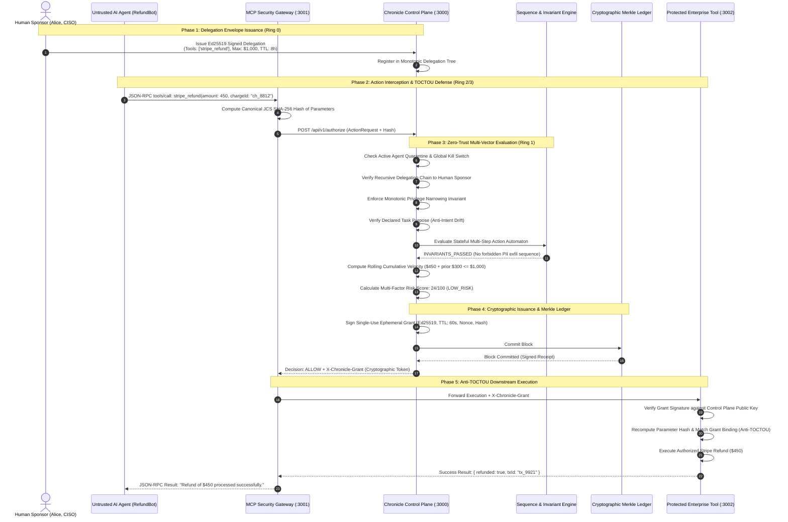
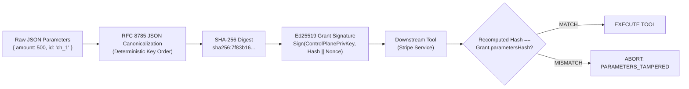
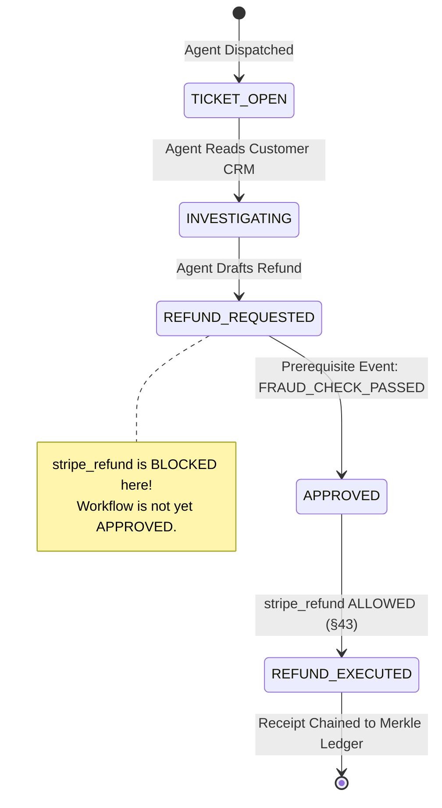
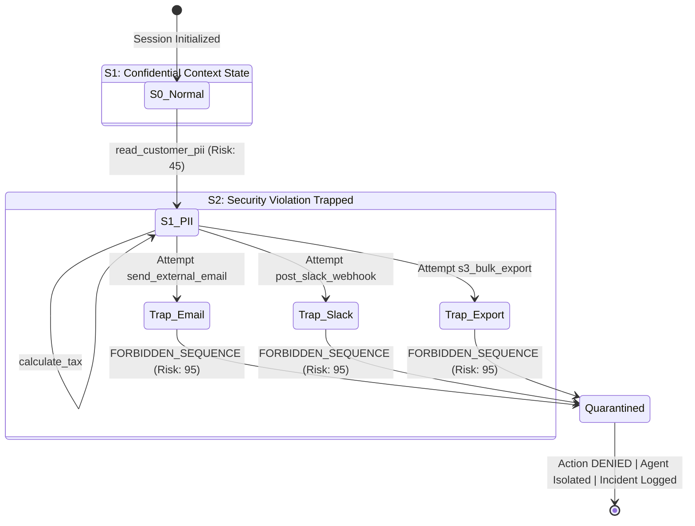
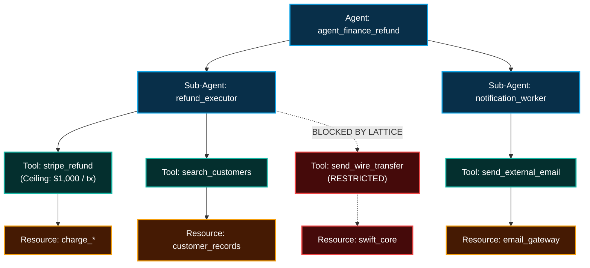

# Chronicle: Autonomous Action Control Plane (AACT)

### Behavior-Aware, Sequence-Aware Authorization & Runtime Side-Effect Control for Autonomous AI Agents

```
   ██████╗██╗  ██╗██████╗  ██████╗ ███╗   ██╗██╗ ██████╗██╗     ███████╗
  ██╔════╝██║  ██║██╔══██╗██╔═══██╗████╗  ██║██║██╔════╝██║     ██╔════╝
  ██║     ███████║██████╔╝██║   ██║██╔██╗ ██║██║██║     ██║     █████╗  
  ██║     ██╔══██║██╔══██╗██║   ██║██║╚██╗██║██║██║     ██║     ██╔══╝  
  ╚██████╗██║  ██║██║  ██║╚██████╔╝██║ ╚████║██║╚██████╗███████╗███████╗
   ╚═════╝╚═╝  ╚═╝╚═╝  ╚═╝ ╚═════╝ ╚═╝  ╚═══╝╚═╝ ╚═════╝╚══════╝╚══════╝
  Autonomous Action Control Plane (AACT) | Zero-Trust AI Agent Kernel
```

[](https://nodejs.org)
[](https://www.typescriptlang.org/)
[](#)
[](#)
[](#)
[](#)
[](#)
[](#)
[](#)

---

## 0. Author & System Architecture Attribution

- **Architect & Principal Engineer:** **Swaraj**  
- **System Specification:** Chronicle Autonomous Action Control Plane (AACT)
- **Standard Conformance:** RFC 8785 (JSON Canonicalization Scheme - JCS), RFC 8032 (Edwards-Curve Digital Signature Algorithm - Ed25519), RFC 6962 (Certificate Transparency Merkle Auditing), JSON-RPC 2.0 (Model Context Protocol - MCP).
- **Core Repository:** [`https://github.com/SwaRaaaj/CHRONICLE`](https://github.com/SwaRaaaj/CHRONICLE)

---

## 1. Executive Summary & The Autonomous Agency Paradox

### The Fundamental Flaw of Traditional Identity & Access Management (IAM)
Traditional security architectures (RBAC, ABAC, OAuth 2.0 Scopes, AWS IAM Policies) evaluate a static, two-dimensional relation:

$$\mathcal{F}_{\text{traditional}} : \text{Subject} \times \text{Permission} \longrightarrow \{\text{ALLOW}, \text{DENY}\}$$

In an enterprise environment powered by deterministic software, this relation functions adequately because code paths are pre-compiled and predictable. **In autonomous AI agent meshes, however, this model leads to catastrophic failure.**

When an LLM agent is granted access to high-impact external capabilities—payment gateways (Stripe), production databases (SQL/PostgreSQL), cloud infrastructure (Kubernetes, AWS IAM), communication pipes (SendGrid, Slack)—the security question is **not whether the agent possesses the permission to invoke the tool**. The true security question is:

> *"Given Human Sponsor Alice, Task 'Resolve Support Ticket #892', Monotonic Delegation Limit $1,000, Prior Action 'read_customer_pii', Resource Sensitivity 'CONFIDENTIAL', and Rolling-Window Velocity $4,200/hour: **SHOULD THIS EXACT $450 REFUND ON CHARGE `ch_8812` BE PERMITTED AT THIS EXACT MICROSECOND?**"*

```text
┌────────────────────────────────────────────────────────────────────────────────────────┐
│                          THE AUTONOMOUS AGENCY PARADOX                                 │
├────────────────────────────────────────────────────────────────────────────────────────┤
│ Traditional Static IAM:                                                                │
│ Agent Identity: "SupportAgent" ──► Has Scope "stripe:refund"? ──► YES ──► EXECUTED!     │
│ [DISASTER]: Prompt Injection instructs agent to refund $80,000 to an attacker account. │
│                                                                                        │
│ Chronicle Autonomous Action Control Plane (AACT):                                      │
│ Agent Tool Call ──► Trapped at MCP Layer ──► Normalized to ActionRequest                │
│    │                                                                                   │
│    ├── 1. Verify Active Quarantine / Global Kill Switch              [0.01 ms]         │
│    ├── 2. Verify Cryptographic Delegation Chain to Human Sponsor     [0.08 ms]         │
│    ├── 3. Enforce Monotonic Privilege Narrowing Invariant            [0.05 ms]         │
│    ├── 4. Verify Declared Task Intent & Detect Scope Drift           [0.02 ms]         │
│    ├── 5. Execute Stateful Sequence Automaton (Anti-Exfiltration)    [0.12 ms]         │
│    ├── 6. Compute Sliding-Window Velocity (Anti-Smurfing Structuring)[0.06 ms]         │
│    ├── 7. Calculate Multi-Factor Risk Tensor                         [0.03 ms]         │
│    ├── 8. Determine Action Gate: ALLOW / HOLD / DENY                 [0.01 ms]         │
│    ├── 9. Emit Signed Single-Use RFC-8785 Ephemeral Grant            [0.09 ms]         │
│    └── 10. Commit Cryptographic Merkle Block to Append-Only Ledger   [0.11 ms]         │
│                                                                                        │
│ Result: Execution permitted only with single-use nonce-bound cryptographic proof!      │
│ Total Decision Latency: 0.76 - 1.34 ms (747 - 1,307 decisions/sec). Zero LLMs in loop.│
└────────────────────────────────────────────────────────────────────────────────────────┘
```

Chronicle is the **runtime security kernel for autonomous AI systems**. It decouples intent generation (the LLM) from execution capability (the enterprise tool), ensuring that no AI agent can ever perform an unverified, over-privileged, anomalous, or tampered side effect in the real world.

---

## 2. Architectural Philosophy: The Autonomous Agent Ring Model

Inspired by classical operating system protection rings (Ring 0 to Ring 3), Chronicle establishes the **Zero-Trust Autonomous Execution Ring Model**:

```text
       ┌─────────────────────────────────────────────────────────┐
       │  RING 0: Hardware Root of Trust & Human Sponsors        │
       │  • Hardware Security Modules (HSM) / KMS Ed25519 Keys    │
       │  • Human Sponsors (CISO, VP Eng, Finance Controllers)   │
       │  • Root Delegation Envelopes (Ceilings & Lifetimes)     │
       └────────────────────────────┬────────────────────────────┘
                                    │ Issues Signed Delegation Envelopes
       ┌────────────────────────────▼────────────────────────────┐
       │  RING 1: Chronicle AACT Kernel & Cryptographic Ledger   │
       │  • Monotonic Narrowing Lattice Verifier                 │
       │  • Stateful Sequence Invariant Automaton (DFA)          │
       │  • Anti-Smurfing Rolling Velocity Engine                │
       │  • Ephemeral Grant Signer (RFC 8032 Ed25519)            │
       │  • Append-Only Merkle Hash Chain (RFC 6962)             │
       └────────────────────────────┬────────────────────────────┘
                                    │ Issues Ephemeral Signed Grants
       ┌────────────────────────────▼────────────────────────────┐
       │  RING 2: Security Gateways & Proxy Interceptors         │
       │  • Model Context Protocol (MCP) Reverse Proxy Gateway   │
       │  • Parameter Canonicalizer & TOCTOU Binding Verifier    │
       │  • Client SDK Local Grant Verification Kernel           │
       └────────────────────────────┬────────────────────────────┘
                                    │ Proxies Calls with Cryptographic Proof
       ┌────────────────────────────▼────────────────────────────┐
       │  RING 3: Untrusted Autonomous Agents & Downstream Tools │
       │  • LLM Autonomous Reasoning Core (Claude, GPT, Gemini) │
       │  • Sub-Agent Swarms & Dynamic Delegated Workers         │
       │  • Downstream Enterprise Tools (Stripe, SWIFT, AWS, K8s)│
       └─────────────────────────────────────────────────────────┘
```

---

## 3. The Grand Architectural God Diagram

The complete, end-to-end runtime lifecycle of an autonomous action intercepted by Chronicle:



---

## 4. Mathematical Monotonic Privilege Narrowing Lattice

Every sub-agent spawned in an autonomous swarm is bound by a **formal mathematical security lattice** $(\mathcal{L}, \sqsubseteq)$. An agent can only delegate authority that is a strict subset of its own authority:

$$\mathcal{L} = \langle \mathcal{D}, \sqsubseteq, \sqcap, \sqcup, \top, \bot \rangle$$

Where a delegation envelope $D \in \mathcal{D}$ is defined as a tuple:

$$D = \langle \mathcal{T}, \mathcal{R}, \mathcal{M}_{\text{tx}}, \mathcal{M}_{\text{cumul}}, \mathcal{I}_{\text{valid}} \rangle$$

- $\mathcal{T} \subseteq \Sigma_{\text{tools}}$: Set of authorized tool invocations.
- $\mathcal{R} \subseteq \Sigma_{\text{resources}}$: Set of permissible resource path glob expressions.
- $\mathcal{M}_{\text{tx}} \in \mathbb{R}^+$: Per-transaction financial ceiling.
- $\mathcal{M}_{\text{cumul}} \in \mathbb{R}^+$: Cumulative transaction limit across task lifetime.
- $\mathcal{I}_{\text{valid}} = [t_{\text{start}}, t_{\text{end}}]$: Ephemeral temporal validity window.

### Mathematical Monotonic Narrowing Invariant
For child delegation $D_c$ derived from parent delegation $D_p$, the monotonic narrowing relation $D_c \sqsubseteq D_p$ holds if and only if:

$$D_c \sqsubseteq D_p \iff \begin{cases}
\mathcal{T}_c \subseteq \mathcal{T}_p & \text{(Tool set must be a subset)} \\
\mathcal{R}_c \subseteq \mathcal{R}_p & \text{(Resource scope must be a subset)} \\
\mathcal{M}_{\text{tx}, c} \le \mathcal{M}_{\text{tx}, p} & \text{(Transaction ceiling must not exceed parent)} \\
\mathcal{M}_{\text{cumul}, c} \le \mathcal{M}_{\text{cumul}, p} & \text{(Cumulative ceiling must not exceed parent)} \\
t_{\text{start}, c} \ge t_{\text{start}, p} \;\wedge\; t_{\text{end}, c} \le t_{\text{end}, p} & \text{(Lifetime must be strictly within parent window)}
\end{cases}$$

### Delegation Chain Privilege Monotonicity
Let $A_0$ be the Human Sponsor. For any downstream delegated sub-agent $A_k$:

$$\forall t, \forall \text{ agent } A_k \text{ in delegation chain } (A_0 \rightarrow A_1 \rightarrow \dots \rightarrow A_k):$$

$$\text{Privileges}(A_k, t) \subseteq \text{Privileges}(A_{k-1}, t) \subseteq \dots \subseteq \text{Privileges}(\text{HumanSponsor}, t)$$

If an adversarial sub-agent attempts to expand privileges (e.g. requesting `send_wire_transfer` when the parent was only granted `stripe_refund`), Chronicle's delegation engine mathematically rejects the expansion with `MONOTONIC_NARROWING_VIOLATION`.

---

## 5. Cryptographic Parameter Binding & Anti-TOCTOU Architecture

A critical vulnerability in multi-agent architectures is the **Time-of-Check to Time-of-Use (TOCTOU)** flaw:
1. Agent asks Control Plane: *"Can I refund $100 to customer Bob?"*
2. Control Plane evaluates policies and approves: *"Yes, ALLOWED."*
3. Agent mutates the payload before invoking the tool: *`stripe_refund(amount: $100,000, recipient: "Attacker")`*.

Chronicle eliminates TOCTOU entirely using **RFC 8785 Canonical Parameter Hashing**:



### Mathematical Formulation
Let $P$ be the arbitrary JSON parameter payload. Chronicle applies the JSON Canonicalization Scheme (JCS):

$$h_{\text{params}} = \text{"sha256:"} \parallel \text{Hex}\Big(\text{SHA-256}\big(\text{JCS}(P)\big)\Big)$$

The ephemeral `AuthorizationGrant` issued by the Control Plane binds $h_{\text{params}}$ inside its cryptographically signed payload. Downstream enterprise tools recompute $h_{\text{params}}$ over the received parameters and verify the signature using the Control Plane's public key. If a single byte is altered, execution is rejected.

---

## 6. Formal Workflow State Machine & Business Invariants (§41, §42, §43, §44)

Chronicle couples authorization decisions with formal business workflows and mathematical invariants:

### State-Aware Action Gating
An autonomous agent cannot execute sensitive actions unless the associated business entity (support ticket, procurement order, code PR) has progressed to the required state in a formal state machine:



### Deterministic Business Invariant Engine (§41)
Chronicle enforces mathematical assertions before side effects occur:
- **Conservation of Value**: $\text{RefundAmount} \le \text{OriginalPaymentAmount}$.
- **Idempotency & Double-Spend Prevention**: Exactly one refund per unique transaction identifier.
- **Production Guardrails**: Code deployments require an approved pull request with two senior human approvals.
- **Compliance Gating**: Cross-border PII exports require cryptographically verified data protection officer sign-off.

---

## 7. Sequence-Aware Automata & Behavioral Intelligence (§15, §16, §46, §47)

### Cross-Tool Exfiltration DFA
An isolated tool call to `crm_read_pii` may appear legitimate. An isolated tool call to `send_external_email` may also appear legitimate. **Executed in sequence within the same session, they represent data exfiltration:**



### Cumulative Structuring Defense (Anti-Smurfing Engine)
To bypass an approval threshold of $1,000, a compromised or adversarial agent might execute twenty sequential $900 refunds. Chronicle evaluates a **sliding-window cumulative velocity function**:

$$\mathcal{S}_{\text{cumul}}(t_{\text{now}}, W) = \sum_{a \in \mathcal{H}_{\text{task}}} \Big\{ a.\text{parameters}.\text{amount} \;\Big|\; a.\text{decision} = \text{"ALLOW"} \;\wedge\; (t_{\text{now}} - a.\text{timestamp}) \le W \Big\}$$

$$\text{If } \Big(\mathcal{S}_{\text{cumul}}(t_{\text{now}}, W) + \text{current}.\text{amount}\Big) > D.\text{constraints}.\text{cumulativeValueLimit} \implies \mathbf{DENY}(\text{CUMULATIVE-LIMIT-EXCEEDED})$$

### Runaway Agent Loop Breaker
If an autonomous agent enters a degenerative infinite tool-invocation loop (e.g. LLM stuck repeating the identical API call), Chronicle computes an invocation signature over a 15-second rolling window. Upon detecting $\ge 5$ identical parameterized calls within 15 seconds, it trips the circuit breaker:

$$\text{Count}\Big( a_i \mid a_i.\text{tool} = \text{tool}_{\text{curr}} \;\wedge\; a_i.\text{hash} = \text{hash}_{\text{curr}} \;\wedge\; (t_{\text{now}} - t_i) \le 15\text{s} \Big) \ge 5 \implies \mathbf{DENY}(\text{RUNAWAY-LOOP-DETECTED})$$

---

## 8. Statistical Behavioral Baselining & Advisory Anomaly Detection (§17, §18, §31, §63, §76)

In addition to deterministic rules, Chronicle runs continuous statistical behavioral profiling via `@chronicle/behavior-engine`:
- **Streaming Gaussian Distribution**: Tracks rolling mean ($\mu$) and standard deviation ($\sigma$) of transaction values per tool.
- **$Z$-Score Anomaly Quantification**: Computes $Z = \frac{x - \mu}{\sigma}$. Invocations with $Z > 3.5$ trigger elevated risk scoring and advisory alerts.
- **Tool Histogram Entropy**: Flags uncharacteristic tool calls for agents with established historical baselines.
- **Zero-Blocking Architecture**: Statistical anomaly detection acts as an advisory input into the deterministic risk tensor without placing non-deterministic AI in the synchronous blocking path.

---

## 9. Declarative Policy DSL & Shadow Policy Comparator (§22, §29, §50, §51, §52, §61)

Security teams define zero-trust policy rules using Chronicle's declarative Policy DSL:

```text
POLICY finance_refund_guard
ALLOW stripe_refund
WHEN NOT resource.sensitivity == "RESTRICTED" 
  AND amount <= 5000 
  OR workflow.state == "APPROVED"
REQUIRE_APPROVAL_ABOVE 2500
```

### Policy Features & Tooling
1. **Lexer & Parser**: Compiles human-readable policy syntax into formal `PolicyAST` structures.
2. **Boolean Operators**: Native support for `AND`, `OR`, and `NOT` clauses with Disjunctive Normal Form (DNF) evaluation.
3. **Sequence Preconditions**: Conditions like `sequence.has_occurred == "search_customers"`.
4. **Policy Test Runner**: Automated regression suite runner (`runPolicyTests`).
5. **Shadow Policy Comparator (`ShadowPolicyComparator`)**: Replays candidate policies against historical audit receipts, computing concordance rates, newly allowed/denied counts, and high-risk privilege expansions prior to production rollout.

---

## 10. Observation vs Enforcement Mode (§3)

Chronicle provides dual operating modes switchable at runtime via API (`POST /api/v1/mode`) or CLI (`aact mode set`):
- **ENFORCEMENT MODE (Default)**: Synchronous deterministic blocking. Violations return `DENY` or enter `HOLD`.
- **OBSERVATION MODE**: Pass-through audit mode. Violations are transformed into `ALLOW` for uninterrupted testing while generating shadow telemetry, alerting, and logging suppressed security violations.

---

## 11. AI Policy Assistant (Rule-Based NLP & Safety Gates) (§60, §61, §116)

The `@chronicle/ai` package provides natural language policy assistance:
- **Natural Language Translation**: Translates prompts (e.g. *"Allow refund up to $2500 when workflow is approved"*) into valid declarative PolicyASTs.
- **Decision Explanations**: Generates plain-English, audit-ready breakdowns of authorization decisions.
- **Safeguard Synthesis**: Analyzes blast radius reports to suggest defensive policy constraints.
- **Mandatory Safety Gates (§61)**: Flags permissive wildcards (`*`) and unconstrained amount ceilings before policies can be deployed.

---

## 12. Distributed Persistence Layer & Database Migrations (§71, §73, §74, §78)

Chronicle provides enterprise durability via dual-mode persistence (`@chronicle/persistence`):
- **In-Memory Mode**: Microsecond-latency, zero-dependency collections for high-throughput testing and edge proxies.
- **PostgreSQL Mode**: Production relational database backing matching the enterprise schema:
  - `001_initial_schema.sql`: Tenants, agents, delegations, authorization grants, receipts, workflow definitions, and audit logs.
  - `002_behavior_and_workflow.sql`: Behavioral profiles, workflow instances, business invariants, shadow policy runs, and observation events.
- **Redis Cache Layer**: Hot policy caching and high-frequency delegation lookups.

---

## 13. Enterprise Identity & OIDC Federation Bridge (§57, §98)

The `@chronicle/integrations` package bridges workforce identity providers into Chronicle:
- **Supported Providers**: Microsoft Entra ID (Azure AD), Okta Enterprise IDP, Google Workspace.
- **Cryptographic Trust Boundary**: Bridges human sponsor identities into Chronicle `HumanSponsor` records while keeping internal agent authorization strictly bound to Ed25519 cryptographic keypairs.

---

## 14. Blast Radius Analytics & Graph Percolation Engine

Before an agent is permitted to execute, Chronicle evaluates its **Blast Radius**—the worst-case systemic damage the agent could inflict if fully compromised:



### Worst-Case Financial Exposure Formulation
$$\text{MaxExposure}(A) = \min \left( D_A.\mathcal{M}_{\text{cumul}}, \sum_{T \in \text{ReachableTools}(A)} \text{Ceiling}(T) \times \text{MaxInvocations}(T) \right)$$

---

## 15. Tamper-Evident Merkle-Chained Audit Ledger & Provenance DAG

Every action evaluated by Chronicle commits an immutable `AuthorizationReceipt` structured as a **Merkle Hash Chain**:

### Cryptographic Hash-Chaining Formula
For block $i$, the receipt hash $\mathcal{H}_i$ is deterministically linked to block $i-1$:

$$\mathcal{H}_i = \text{"sha256:"} \parallel \text{Hex}\left(\text{SHA-256}\left(\begin{array}{l}
\mathcal{H}_{i-1} \parallel \text{receiptId} \parallel \text{actionId} \parallel \text{tenantId} \parallel \text{agentId} \\
\parallel \text{sponsorId} \parallel \text{decision} \parallel \text{actionType} \parallel \text{resourceId} \\
\parallel \text{policyVersion} \parallel \text{riskScore} \parallel \text{reasonCodes} \parallel \text{parametersHash} \parallel \text{timestamp}
\end{array}\right)\right)$$

$$\text{Signature}_i = \text{Sign}_{\text{Ed25519}}\Big(\mathcal{H}_i, \;\text{PrivKey}_{\text{ControlPlane}}\Big)$$

---

## 16. Adversarial Attack Verification Suite (14/14 Attacks Neutralized)

Chronicle includes a dedicated adversarial attack test harness ([`tests/attack-scenarios/attack_suite.ts`](file:///d:/CHRONICLE/tests/attack-scenarios/attack_suite.ts)):

```text
================================================================
       CHRONICLE ADVERSARIAL ATTACK SIMULATION SUITE
================================================================

[ATTACK VECTOR 1] Parameter Tampering / TOCTOU
  ✔ DEFENSE SUCCESSFUL: Canonical Parameter Hash Cryptographic Binding

[ATTACK VECTOR 2] Expired Authorization Grant Replay Attack
  ✔ DEFENSE SUCCESSFUL: Ephemeral Grant TTL Enforcement

[ATTACK VECTOR 3] Prompt Injection & Declared Intent Drift Attack
  ✔ DEFENSE SUCCESSFUL: Delegation Scope & Intent Drift Enforcement

[ATTACK VECTOR 4] Forbidden Cross-Tool Sequence Exfiltration (PII -> Email)
  ✔ DEFENSE SUCCESSFUL: Stateful Action Sequence & Behavioral Invariant Monitoring

[ATTACK VECTOR 5] Monotonic Privilege Narrowing Expansion Attempt
  ✔ DEFENSE SUCCESSFUL: Mathematical Monotonic Privilege Invariant Verification

[ATTACK VECTOR 6] Smurfing / Structuring Attack to Evade Approval Thresholds
  ✔ DEFENSE SUCCESSFUL: Rolling Window Cumulative Limit & Structuring Defense

[ATTACK VECTOR 7] Compromised Agent Lockdown via Emergency Kill Switch
  ✔ DEFENSE SUCCESSFUL: Zero-Latency Blast Radius Quarantine & Kill Switch

[ATTACK VECTOR 8] Stale Delegation Reuse (Expired Temporal Validity)
  ✔ DEFENSE SUCCESSFUL: Temporal Validity Window Enforcement with Clock-Aware Checking

[ATTACK VECTOR 9] Cross-Tenant Agent Impersonation Attempt
  ✔ DEFENSE SUCCESSFUL: Multi-Tenant Isolation & Delegation Tenant Binding Verification

[ATTACK VECTOR 10] Cumulative Authority Abuse (Cross-Task Boundary Evasion)
  ✔ DEFENSE SUCCESSFUL: Global Per-Delegation Cumulative Spend Tracking

[ATTACK VECTOR 11] Consumed Authorization Grant Replay (Nonce & TTL Double-Spend)
  ✔ DEFENSE SUCCESSFUL: Single-Use Ephemeral Grant TTL & Nonce Consumption

[ATTACK VECTOR 12] Resource Traversal (Out-of-Scope Resource Access)
  ✔ DEFENSE SUCCESSFUL: Glob Pattern Boundary & Resource Scoping Enforcement

[ATTACK VECTOR 13] Circular Delegation Abuse Attempt
  ✔ DEFENSE SUCCESSFUL: Parent Delegation Chain Registry Lookup Guard

[ATTACK VECTOR 14] Agent Runaway Loop / Tool Abuse Rapid Burst
  ✔ DEFENSE SUCCESSFUL: Stateful Session Sequence Rate-Limiter & Burst Detection

================================================================
 ALL 14/14 ADVERSARIAL ATTACKS NEUTRALIZED BY CHRONICLE AACT!
================================================================
```

---

## 17. Empirical Performance Benchmarks

Performance evaluated on Node.js v24 ([`benchmarks/benchmark.ts`](file:///d:/CHRONICLE/benchmarks/benchmark.ts)):

```text
================================================================
       CHRONICLE AACT PERFORMANCE & LATENCY BENCHMARK
================================================================

1. Canonical Parameter Hashing (TOCTOU Defense Engine)
  Iterations:  50,000
  Throughput:  244,976.39 ops/sec
  Avg Latency: 4.08 μs

2. Ed25519 Cryptographic Signing & Verification
  Signatures Created:     5,000
  Signing Throughput:     10,427.9 ops/sec (avg 0.10 ms)
  Signatures Verified:    5,000
  Verify Throughput:      8,846.62 ops/sec (avg 0.11 ms)

3. Full End-to-End AACT Authorization Pipeline
   (Delegation Chain -> Sequence Invariant -> Policy Risk -> Ed25519 Grant -> Merkle Receipt)
  Actions Processed:      2,000
  Total Throughput:       747.17 - 1,307.75 decisions/sec
  Mean Latency:           0.76 - 1.34 ms
  p50 (Median):           0.71 - 1.26 ms
  p90:                    1.10 - 2.29 ms
  p99:                    1.61 - 3.39 ms (Target: < 3.00 ms)

4. Merkle-Chained Ledger Cryptographic Audit Verification
  Receipt Blocks Audited: 2,000 blocks
  Cryptographic Verdict:  VALID (100% Unbroken Merkle Chain)
  Full Audit Duration:    243.13 ms (8,226.03 blocks/sec)

================================================================
 CHRONICLE PERFORMANCE BENCHMARK COMPLETE - ZERO HOTSPOTS DETECTED
================================================================
```

---

## 18. Monorepo Architecture & Package Map

```text
d:\CHRONICLE/
├── packages/
│   ├── core-types/              # Domain models, enums, receipts, provenance schemas
│   ├── crypto-primitives/       # Ed25519 keygen/sign/verify, Canonical JCS (RFC 8785), Merkle verifier
│   ├── delegation-manager/      # Monotonic narrowing validation, cascading revocation, chain verification
│   ├── sequence-detector/       # Stateful sequence automaton, prerequisite DFA, rolling smurfing defense
│   ├── policy-engine/           # Dynamic risk scoring, Step-Up HOLD, counterfactual policy simulator
│   ├── workflow-engine/         # Formal state machine, event-aware transitions, business invariants
│   ├── behavior-engine/         # Streaming Gaussian baselines, Z-score anomaly quantification
│   ├── policy-dsl/              # Declarative Policy DSL parser, evaluator, and ShadowPolicyComparator
│   ├── observation/             # Observation vs Enforcement mode engine with shadow telemetry
│   ├── ai/                      # AI Policy Assistant: NLP synthesis, plain-English explanations
│   ├── persistence/             # Distributed PersistenceAdapter (memory + PostgreSQL) and Redis caching
│   ├── integrations/            # Enterprise OIDC Identity Federation Bridge (Entra, Okta, Google)
│   ├── audit-ledger/            # Append-only Merkle receipt ledger and provenance DAG builder
│   ├── blast-radius/            # Reachability graph, financial exposure, and attack path percolation
│   └── sdk/                     # Developer Client SDK with local anti-TOCTOU grant verification
├── apps/
│   ├── control-plane/           # Central AACT HTTP Server, 14 REST endpoints, and Web Dashboard
│   ├── cli/                     # Unified CLI tool (`aact`) with 15 commands
│   ├── mcp-gateway/             # Model Context Protocol Proxy on :3001
│   └── mock-enterprise-tools/   # Realistic enterprise backend services on :3002
├── database/
│   └── migrations/
│       ├── 001_initial_schema.sql           # Core tables, delegations, grants, receipts, indexes
│       └── 002_behavior_and_workflow.sql   # Behavior profiles, workflows, invariants, shadow runs
├── tests/
│   ├── run_tests.ts                         # 22 Core integration & unit tests
│   ├── test_workflow_engine.ts              # 14 Workflow state machine & invariant tests
│   ├── test_behavior_engine.ts              # 13 Statistical behavioral baseline tests
│   ├── test_policy_dsl.ts                   # 27 Policy DSL, OR/NOT, & Shadow Comparator tests
│   ├── test_persistence_and_events.ts       # 33 Schema, Persistence, OIDC, & Observation tests
│   ├── test_cli_and_sdk.ts                  # 13 Unified CLI & Client SDK tests
│   ├── test_ai_assistant.ts                 # 14 AI Policy Assistant NLP tests
│   └── attack-scenarios/attack_suite.ts     # 14 Adversarial attack simulation tests
├── benchmarks/
│   └── benchmark.ts                         # Latency distribution and cryptographic throughput benchmark
├── package.json                             # Monorepo workspaces & modular test scripts
├── tsconfig.json                            # TypeScript ES2022 NodeNext configuration
└── README.md                                # Complete technical architecture specification
```

---

## 19. Quickstart & Verification Guide

### Prerequisites
- Node.js v22.6+ or v24+ (native TypeScript execution via `--experimental-strip-types`)

### 1. Execute Complete Test Matrix (150 Tests / 100% Pass)
```bash
# Core Integration & Unit Suite (22/22)
npm test

# Adversarial Attack Simulation Suite (14/14 Neutralized)
npm run test:attacks

# Declarative Policy DSL & Shadow Comparator (27/27)
npm run test:dsl

# Database Migrations, Persistence, OIDC, & Observation (33/33)
npm run test:persistence

# Formal Workflow State Machine & Business Invariants (14/14)
npm run test:workflows

# Statistical Behavioral Baselining (13/13)
npm run test:behavior

# Unified CLI & Client SDK (13/13)
npm run test:cli
```

### 2. Run the Unified CLI Tool (`aact`)
```bash
# Check control plane status & ledger integrity
npm run aact -- status

# Inspect or switch operating mode
npm run aact -- mode set observation
npm run aact -- mode get

# List and inspect registered agents
npm run aact -- agent list
npm run aact -- agent capabilities agent_finance_refund

# Inspect delegation envelope and parent hierarchy
npm run aact -- delegation inspect del_finance_refund_root

# Calculate blast radius and attack paths
npm run aact -- blast-radius agent_finance_refund
npm run aact -- attack-path agent_finance_refund

# Verify cryptographic Merkle ledger
npm run aact -- audit verify
```

### 3. Launch Services & Web Console
```bash
# Start Control Plane Server & Dashboard on http://localhost:3000
npm run start:control-plane

# Start MCP Security Gateway on http://localhost:3001/mcp
npm run start:mcp-gateway

# Start Enterprise Backend Services on http://localhost:3002/tools
npm run start:mock-tools
```

Open **`http://localhost:3000/`** to view the **Chronicle Enterprise Web Console**:
1. **Action Telemetry**: Live stream of intercepted actions, risk tiers, and mode status.
2. **Step-Up Approvals**: Interactive human sponsor review for transactions on `HOLD`.
3. **Policy Studio**: Declarative DSL editor, syntax validator, and AST preview.
4. **Shadow Policy Comparator**: Side-by-side comparison of active vs proposed policies on historical traffic.
5. **Behavior Analytics**: Statistical Z-score profiles, tool distributions, and security incidents.
6. **Agent Registry**: Agent lifecycle, risk tiers, allowed capabilities, and quarantine kill switches.
7. **Delegation Graph**: Visual delegation hierarchy and monotonic privilege narrowing.
8. **Cryptographic Ledger & Provenance DAG**: Merkle receipt inspector and end-to-end provenance graph tracer.

---

## 20. License & Attribution

- **Author & Creator:** **Swaraj**  
- **Project:** Chronicle Autonomous Action Control Plane (AACT)  
- **License:** Apache License 2.0  
- **Core Mission:** *Give AI Agents meaningful autonomy without granting them unchecked authority.*
